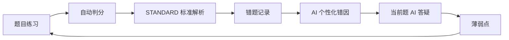
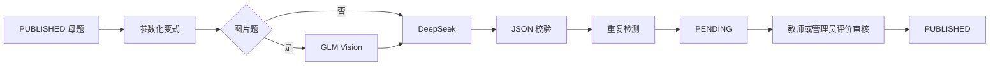

# RIKE 理科学习辅助系统

**面向高中物化生的 Spring Boot 大模型题库系统设计与实现**

面向高中物理、化学、生物学习场景，集成题库、在线练习、错题分析、AI 当前题答疑、可控变式题生成和人工审核的本科毕业设计系统。

项目早期使用过“集成大模型智能答疑的在线题库实训管理系统”这一标题，当前论文题目与仓库首页统一采用上方正式名称。

## 当前状态

| 能力 | 状态 |
| --- | --- |
| 非 AI 主链 | `DONE_VERIFIED` |
| AI Provider Core | `DONE_VERIFIED` |
| 学生 AI 错因分析 | `DONE_VERIFIED` |
| 当前题有限多轮答疑 | `DONE_VERIFIED` |
| 真实 DeepSeek | `PASS` |
| 管理员 AI 模型配置 | `DONE_VERIFIED` |
| GLM Vision 代码链 | `DONE_VERIFIED` |
| 真实 GLM Smoke | `REAL_GLM_VISION_SMOKE_FAIL_429` |
| AI 候选变式题 | `DONE_VERIFIED` |
| 教师、管理员人工审核 | `DONE_VERIFIED` |
| 最终全量回归 | `PR #31 PENDING` |
| 最终用户人工验收 | `PR #31 PENDING` |

这里的 `DONE_VERIFIED` 表示对应开发阶段的受影响专项与必要构建已经通过。完整全量回归、最终真实全链路和最后一次用户人工验收仍由 PR #31 完成，因此当前不能表述为百分之百最终验收完成。详细证据见 [开发状态](docs/DEVELOPMENT_STATUS.md)。

## 核心学习闭环



AI 候选题始终经过人工审核，不直接进入学生练习。



## 三类角色

### STUDENT

- 登录、练习、自动判分与 STANDARD 标准解析
- 错题本、高频考点与学习情况
- AI 错因分析与 RIKE 当前题答疑
- 师生消息

### TEACHER

- 按任教班级与学科查看学生学习情况和高频考点
- 师生消息
- AI 变式题生成、候选质量评价与候选题审核

### ADMIN

- 学生、教师、班级与任课关系管理
- 题库、导入、审核发布、附件与操作日志
- AI 模型配置、DeepSeek 与 GLM Key、连接测试
- AI 候选题与全局质量统计

## AI 架构

DeepSeek V4 是文本推理“大脑”，负责错因分析、当前题答疑和候选变式题生成。GLM-4.6V-Flash 是视觉“眼睛”，只负责图片题视觉语义提取。

```text
图片 → GLM → UNTRUSTED_VISION_CONTEXT → DeepSeek
```

- GLM 不负责正式判分，也不能覆盖 STANDARD。
- DeepSeek 的分析和候选答案不覆盖 STANDARD。
- 学生端不显示 Provider、模型代码、API 地址、Key 或 Token。
- 学生端统一使用“RIKE 理科学习助手”身份。
- Provider 调用日志只保存安全元数据，不保存 Prompt、输出、图片 Base64 或 Key。

## 受控限制

学生答疑只绑定当前题，最多 8 轮；单条用户消息最多 500 字；Provider 上下文最多最近 12 条消息，总字符预算 6000。无关闲聊会被限制回当前物理、化学、生物学习场景。

Vision 每题最多 2 张图片，单图不超过 3 MB，总量不超过 6 MB，只接受 PNG/JPEG。附件按 SHA-256 去重，GLM 输出必须通过受控 JSON 校验，相同视觉上下文优先复用缓存。

变式题每次生成 1 至 3 道，同一母题的 `AI_GENERATED + PENDING` 候选最多 6 道。系统使用 request hash、精确内容 hash、批内去重和 trigram/Jaccard 疑似重复提示。候选只能先进入 `PENDING`，人工审核通过后才能发布。

## 技术栈

### Backend

- Java 25
- Spring Boot 4.1
- Maven、Spring MVC、Spring Security、JWT
- MyBatis-Plus 3.5.17、Flyway、MySQL 8.4
- Apache POI、SpringDoc

### Frontend

- Vue 3、TypeScript、Vite
- Element Plus、Pinia、Vue Router、Axios
- GSAP、KaTeX

### AI

- DeepSeek OpenAI-compatible API
- GLM-4.6V-Flash Vision
- Fake/Stub Provider
- Structured JSON
- Metadata-only AI call log

Redis、消息队列、向量数据库、WebSocket 和微服务不是当前主线依赖。

## 数据库

当前 Flyway 为 V1–V14，共 35 张业务表。已执行迁移不得修改。

- V12：`ai_diao_yong_ri_zhi`
- V13：`ai_cuo_ti_fen_xi`、`ai_hui_hua`、`ai_xiao_xi`
- V14：`ai_mo_xing_pei_zhi`、`ai_sheng_cheng_ren_wu`、`ai_hou_xuan_ti_zhi_liang_ping_jia`、`ai_shi_jue_shang_xia_wen`

完整模型见 [数据库模型](docs/DATABASE_MODEL_V2.md)。

## 管理员 AI 配置

管理员在 `/admin/ai-models` 配置 DeepSeek TEXT 与 GLM VISION，包括 model、base URL、Key、启停、默认配置、超时、重试、max tokens 和连接测试。

本地本科毕设 Demo 模式允许 MySQL 保存 Key。API 不回显完整 Key，页面只显示是否已配置，调用日志不保存 Key。这是本地演示便利设计，不是生产级 KMS。

## 快速启动

### MySQL

准备 MySQL 8.4 和数据库 `rike_tiku`。应用启动时由 Flyway 自动校验并迁移到 V14。正式库与独立验收库 `rike_tiku_demo` 的用途不同，Demo 工具不会接受正式库名。

### Backend

```powershell
cd rike-tiku-backend
$env:RIKE_TIKU_DB_PASSWORD = "<本机 MySQL 密码>"
$env:RIKE_TIKU_JWT_SECRET = "<至少 32 字节的本机随机密钥>"
mvn spring-boot:run
```

后端默认运行于 `http://localhost:8081`，健康检查为 `http://localhost:8081/api/v1/health`。数据库地址、账号和端口可通过 `RIKE_TIKU_DB_HOST`、`RIKE_TIKU_DB_PORT`、`RIKE_TIKU_DB_NAME`、`RIKE_TIKU_DB_USERNAME` 和 `RIKE_TIKU_BACKEND_PORT` 覆盖。

也可以在后端目录运行 `./scripts/setup-idea-local-env.ps1`，按提示为 IDEA 准备本机环境变量。详细说明见 [后端启动说明](rike-tiku-backend/README.md)。

### Frontend

```powershell
cd rike-tiku-frontend
Copy-Item .env.example .env.local
npm install
npm run dev
```

前端默认运行于 `http://localhost:8080`，默认 API 地址为 `http://localhost:8081/api/v1`。详细说明见 [前端启动说明](rike-tiku-frontend/README.md)。

### 启用真实 AI

可以在管理员后台 `/admin/ai-models` 保存并启用数据库配置，也可以使用 application/env 回退配置。AI 默认关闭，未配置 Key 不影响登录、题库、练习、判分、错题和 STANDARD。

环境变量名与安全默认值见 [AI Provider 配置](docs/AI_PROVIDER_CONFIGURATION.md)。仓库不应保存真实数据库密码、JWT 密钥或 Provider Key。

## 项目结构

```text
rike-tiku-backend/   Spring Boot 模块化单体后端
rike-tiku-frontend/  Vue 3 前端
docs/                当前文档、历史验收与证据索引
题库/                题库素材与导入验证资料
脚本/                清洗、核验等辅助脚本
scripts/             Demo 环境与验收启动脚本
```

文档导航见 [docs/README.md](docs/README.md)。

## 测试与验收

- PR #29 的真实 `deepseek-v4-flash` smoke 为 PASS，严格 JSON Parser 与日志脱敏均通过。
- PR #30 主实现专项为后端 54/54、前端 12/12；集中修正专项为后端 38/38、前端 32/32。
- PR #30 的 package、type-check、build 与 `git diff --check` 均为 PASS。
- 真实 GLM 请求到达官方 endpoint，但最终返回 HTTP 429，状态为 `REAL_GLM_VISION_SMOKE_FAIL_429`，不能记为 PASS。
- 不把不同轮次、可能重叠的测试数相加成虚假总数。
- 完整全量回归、Demo、机器浏览器和最终用户人工验收由 PR #31 执行。

## 最终阶段

下一阶段唯一任务是 PR #31 `chore/final-ai-integration-verification`。

范围包括全量自动化回归、Flyway、Demo、DeepSeek、GLM、AI 配置后台、学生错因、当前题聊天、候选题生成审核、权限与降级验证、全站机器浏览器、一次最终用户人工验收，以及论文、README 和答辩口径统一。PR #31 原则上不新增业务功能，只处理集成缺陷、测试问题与最终封板。
