# RIKE 理科学习辅助系统

面向高中物理、化学、生物的 Spring Boot 大模型题库系统。系统把题库、练习判分、STANDARD 解析、错题学习、教师教学管理和受控 AI 能力放在同一条可追溯业务链中。

> 默认 GitHub 首页的 `main` README 已提供本 Draft 分支的截图、代码、数据库、Excel、论文和文献远程预览入口；本分支保留以下完整最终交付 README。PR #33 仍为 Draft，尚未 ordinary merge。

> 论文题目：面向高中物化生的 Spring Boot 大模型题库系统设计与实现

## 系统效果

| 公共入口 | 学生学习 |
|---|---|
|  | 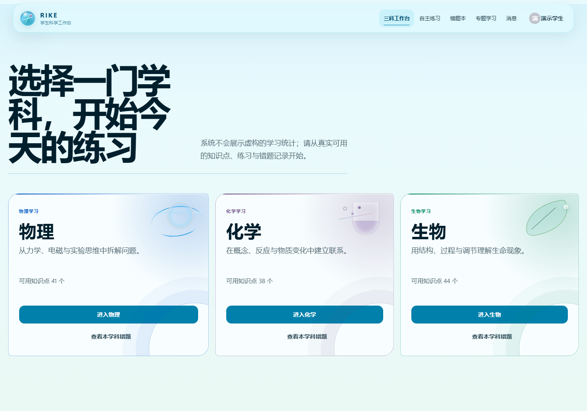 |
|  |  |

| 学生 AI | 教师与管理员 |
|---|---|
| 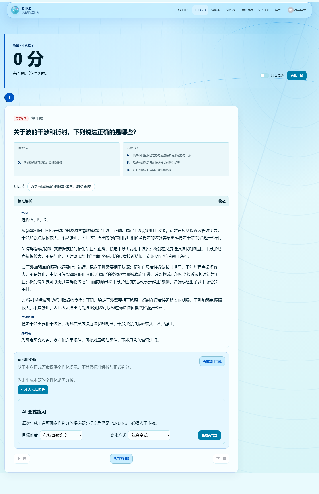 | 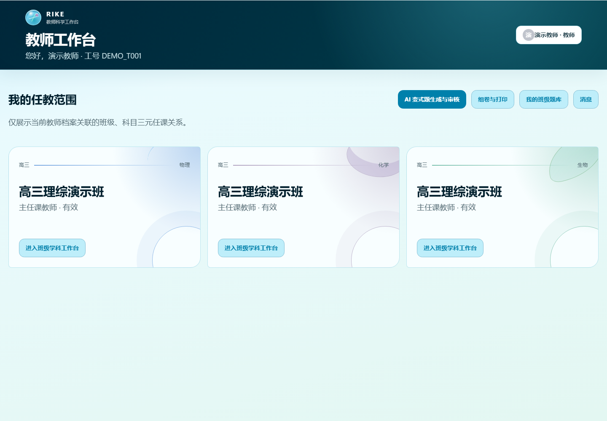 |
| 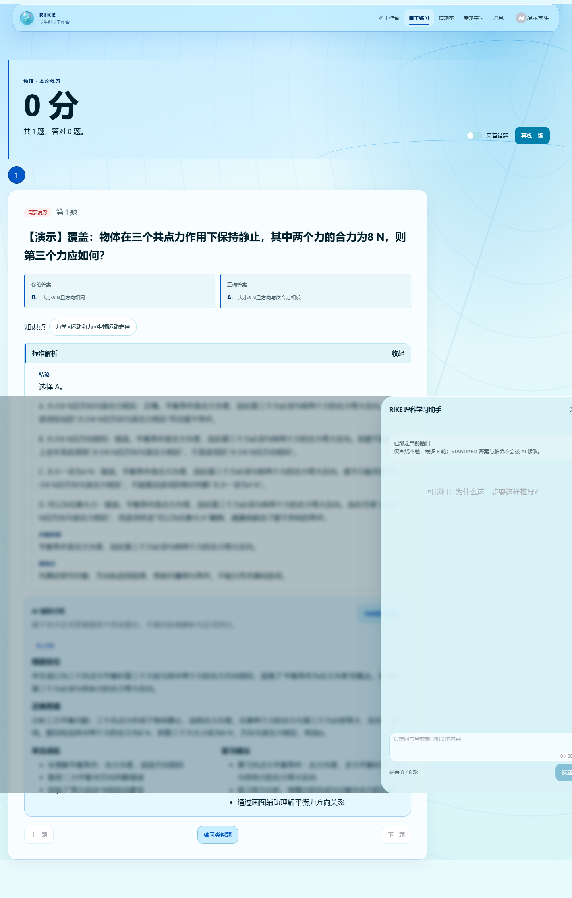 | 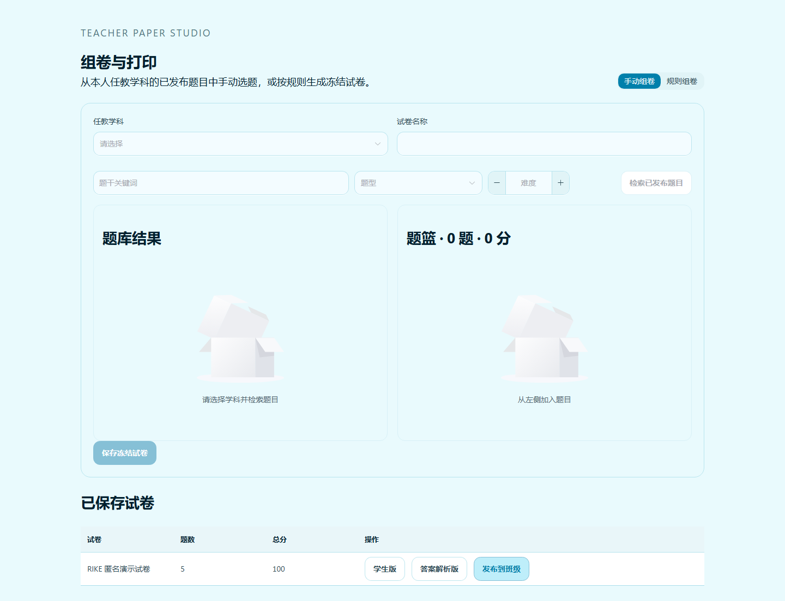 |
| 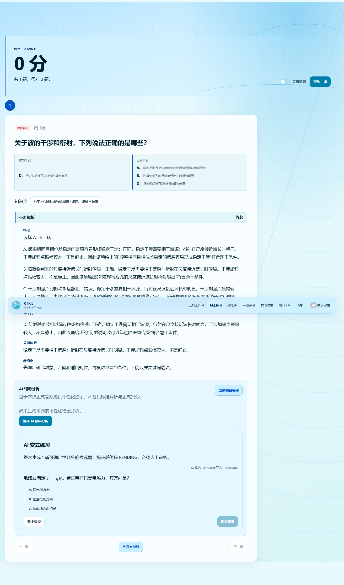 | 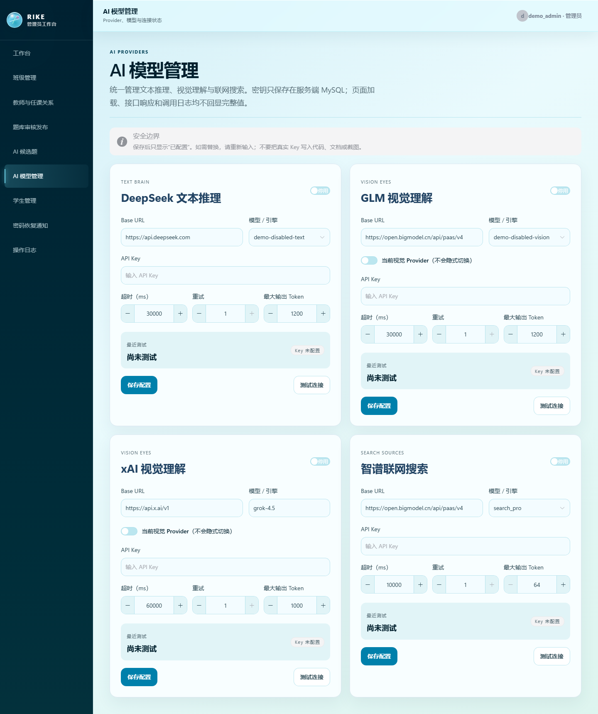 |

| 练习与错题 | 教师审核 |
|---|---|
| 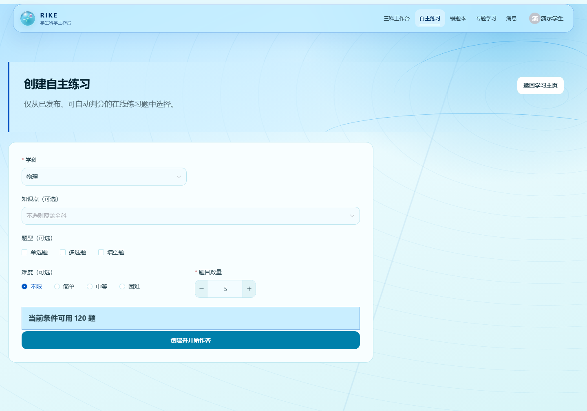 | 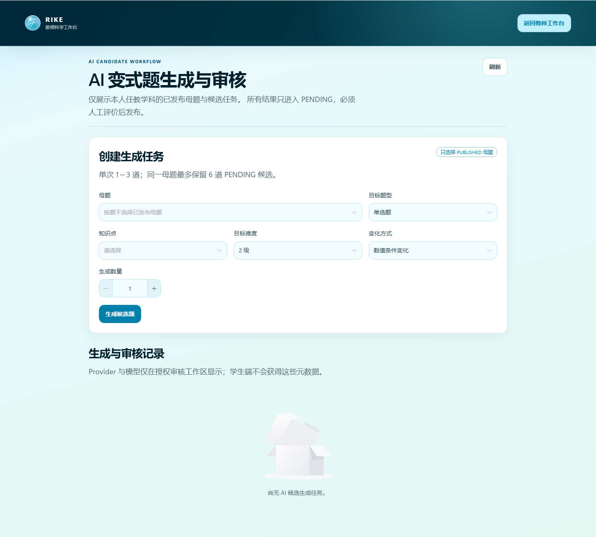 |
| 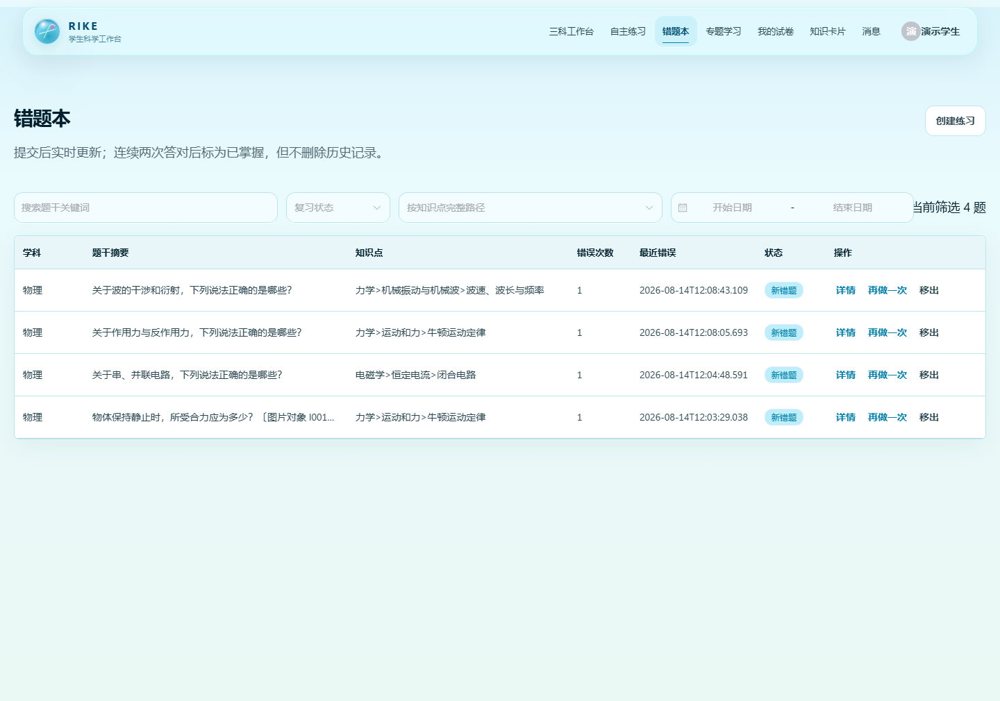 |  |

完整截图含练习、错题、变式结果、教师审核、学生版/答案版试卷、密码恢复通知和移动端，见 [论文插图目录](docs/evidence/thesis-final/README.md)。

## 核心闭环

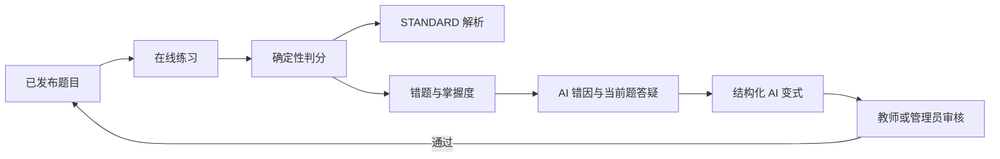

STANDARD 是正式答案事实。AI 可以解释、生成候选题和提供受控网络来源，但不能改写判分结果或 STANDARD。学生生成的变式题初始为 `PENDING`，人工审核通过后才能发布。

## 已实现能力

### 学生

- 三科学科练习、单选/多选/填空确定性判分、STANDARD 解析。
- 错题本、掌握度、高频考点和师生消息。
- 安全科学内容渲染：段落、列表、粗体、行内代码、KaTeX，拒绝 raw HTML。
- 当前题最多 10 轮答疑，可选择 DeepSeek V4 Flash/Pro、标准回答或深度思考。
- 可选智谱官方 Web Search；只返回 3—5 条受控来源，网络摘要按 `UNTRUSTED_WEB_CONTEXT` 处理。
- 每次生成 1 道结构化 AI 变式，支持单选、多选和填空；作答后才显示 AI 解析，可换题、丢弃或提交人工审核。

### 教师

- 按 ACTIVE 任课关系访问班级、学科、学生学习情况与高频考点。
- 生成和审核 AI 候选题，候选题不能绕过 `PENDING` 直接发布。
- 手动组卷支持已发布题筛选、题篮、顺序和分值；规则组卷支持题型、难度、知识点、数量与目标总分。
- 试卷保存后冻结，可预览学生版和答案解析版，并通过 `window.print()` 打印或另存为 PDF。

### 管理员

- 学生、教师、班级、任课、题库、附件、Excel 导入和操作日志管理。
- DeepSeek TEXT、GLM VISION、智谱 SEARCH 独立配置，Key 只显示“已配置”。
- 连接测试返回安全错误分类、HTTP 状态、延迟与时间，不返回 Key、请求正文或原始响应。
- 接收匿名密码恢复通知，使用现有验证码和统一外部响应；恢复默认密码或驳回均有事务、首次改密和审计记录。

## 技术架构

- 后端：Java 25、Spring Boot 4.1、Spring MVC、Spring Security、JWT、MyBatis-Plus、Flyway、MySQL 8.4。
- 前端：Vue 3、TypeScript、Vite、Element Plus、Pinia、Vue Router、Axios、GSAP、KaTeX。
- AI：DeepSeek Chat Completions、GLM-4.6V-Flash、智谱 Web Search、Fake/Mock Provider。
- 形态：前后端分离的模块化单体。Redis、MQ、WebSocket、向量数据库和微服务不是运行依赖。

```text
Vue 3 SPA
   │ HTTP JSON / JWT
Spring Boot 模块化单体
   ├─ 认证、组织、题库、练习、消息、试卷
   ├─ 学生 AI、候选生成、人工审核
   └─ Provider / Vision / Search 边界
   │
MySQL 8.4 · Flyway V1–V19 · 39 张业务表
```

## AI 安全边界

- 学生只能选择管理员提供的安全模型 ID，不能提交任意 model、Base URL 或 endpoint。
- 标准回答映射 `thinking.disabled`；深度思考映射 `thinking.enabled + reasoning_effort=max`。
- `reasoning_content` 不展示、不持久化、不写日志；业务表只保存最终回答。
- 搜索只调用结构化官方接口，不抓取网页；拒绝 localhost、内网地址、非 HTTP(S) 协议和非法 URL。
- AI 调用日志只保存 provider、model、purpose、业务引用、状态、延迟、Token 与安全错误码。
- 图片、Prompt、完整学生答案、Authorization、Key 和思维链不进入调用日志。

## 数据库

Flyway V1–V19 共演进为 39 张业务表。V15–V19 依次完成 10 轮约束、学生运行时选择与 SEARCH 用途、密码恢复、教师试卷和学生 AI 变式实例；已提交迁移保持不可变。

- [V19 字段与约束参考](docs/DATABASE_SCHEMA_REFERENCE.md)
- [V19 纯结构快照](database/schema_snapshot_v19.sql)（0 条 `INSERT`）
- [数据库模块与 ER 图](database/diagrams/rike_tiku_er.md)
- [SQL 示例](docs/SQL_EXAMPLES.md)

## Excel 导入

- [学生导入模板](docs/templates/student-import-template.xlsx)
- [题目导入模板](docs/templates/question-import-template.xlsx)
- [预览、确认与字段说明](docs/EXCEL_IMPORT_GUIDE.md)

两类导入均先预检查，再由用户确认入库。题目导入进入审核状态，不因 Excel 上传直接发布。

## 本地启动约定

```powershell
cd rike-tiku-backend
# 在进程外安全配置数据库凭据和至少 32 字节 JWT 密钥；不要写入仓库
mvn spring-boot:run
```

```powershell
cd rike-tiku-frontend
Copy-Item .env.example .env.local
npm install
npm run dev
```

默认前端 `http://localhost:8080`，后端 `http://localhost:8081`。AI 未配置时，登录、题库、练习、判分、错题和 STANDARD 仍可使用。

## 测试口径

- 随机临时 MySQL 从空库执行 V1→V19；集成测试不使用正式 `rike_tiku`。
- 匿名验收库 `rike_tiku_demo` 已执行 reset、19 个迁移、seed 与 validate，保持 378 道 PUBLISHED 题基线。
- 前端专项覆盖科学内容、10 轮控制、模型/思考/搜索、变式题、密码恢复、组卷、试卷预览、Portal 和 AI 模型管理。
- 真实 Provider 只有本机已配置 Key 时才执行一次受控 smoke；缺 Key 记为 `NOT_RUN`，不伪造 PASS。

## 论文写作与参考文献

论文材料总入口：[论文写作资料中心](docs/THESIS_WRITING_HUB.md)；[功能—截图—代码—表映射](docs/FEATURE_SCREENSHOT_CODE_INDEX.md)；[论文初稿](docs/thesis/RIKE_THESIS_DRAFT.md)；[事实核对表](docs/thesis/RIKE_THESIS_FACT_CHECK.md)；[答辩提纲](docs/thesis/RIKE_DEFENSE_OUTLINE.md)。数据库论证可直接引用 [V19 字段参考](docs/DATABASE_SCHEMA_REFERENCE.md)、[纯结构快照](database/schema_snapshot_v19.sql)、[ER 模块图](database/diagrams/rike_tiku_er.md) 与 [只读 SQL 示例](docs/SQL_EXAMPLES.md)。

以下核心资料均已按 DOI 元数据、出版方、官方机构或技术官方文档联网核验；它们说明研究与设计依据，不代表 RIKE 自身实验结果。

1. [VanLehn (2011), intelligent tutoring effectiveness](https://doi.org/10.1080/00461520.2011.611369) — 第 1 章研究背景、第 2 章智能辅导系统相关工作。
2. [Zawacki-Richter et al. (2019), AI in higher education systematic review](https://doi.org/10.1186/s41239-019-0171-0) — 第 2 章 AI 教育综述与教师角色。
3. [Kasneci et al. (2023), LLM opportunities and challenges in education](https://doi.org/10.1016/j.lindif.2023.102274) — 第 2 章大模型教育风险、第 5 章安全边界。
4. [Reddig, Arora & MacLellan (2025), personalized feedback](https://doi.org/10.1007/s40593-025-00505-6) — 第 3 章个性化反馈与错因分析设计。
5. [Das et al. (2021), automatic question generation survey](https://doi.org/10.1186/s41039-021-00151-1) — 第 2 章自动出题研究综述。
6. [Elkins et al. (2024), teachers using LLMs to create quizzes](https://doi.org/10.1609/aaai.v38i21.30353) — 第 3 章教师参与、第 4 章候选题人工审核。
7. [UNESCO (2023), Guidance for generative AI in education and research](https://unesdoc.unesco.org/ark:/48223/pf0000386693) — 第 1 章规范背景、第 5 章人类监督与隐私。
8. [《生成式人工智能服务管理暂行办法》](https://app.www.gov.cn/govdata/gov/202307/14/505293/article.html) — 第 1 章政策背景、第 5 章内容与数据治理。
9. [Spring Boot Reference](https://docs.spring.io/spring-boot/reference/) — 第 3 章后端架构与安全实现。
10. [MySQL 8.4 Reference Manual](https://dev.mysql.com/doc/refman/8.4/en/) — 第 3 章数据模型、约束、索引与事务。
11. [MyBatis-Plus Spring Boot 4 官方安装指南](https://baomidou.com/getting-started/install/) — 第 3 章持久层技术选型。
12. [DeepSeek Chat Completion](https://api-docs.deepseek.com/api/create-chat-completion) 与 [Thinking Mode](https://api-docs.deepseek.com/guides/thinking_mode) — 第 3/4 章 TEXT Provider 与深度思考契约。
13. [智谱 GLM-4.6V-Flash](https://docs.bigmodel.cn/cn/guide/models/free/glm-4.6v-flash) 与 [Web Search](https://docs.bigmodel.cn/cn/guide/tools/web-search) — 第 3/4 章视觉和受控联网边界。

完整分类、逐条元数据和用途见 [论文参考文献](docs/THESIS_REFERENCES.md)，引用管理文件见 [BibTeX](docs/references/references.bib)。
