# RIKE 理科学习辅助系统

> **维护事实（2026-08-17）：PR [#33](https://github.com/Fiesty-Abyss/rike-tiku/pull/33) 已合并；当前维护分支将数据库升级至 Flyway V30，业务表仍为 50 张。专题主观题继续以 `ti_mu` 为唯一事实源，可手动进入教师试卷，但不参与自动评分。**

面向高中物理、化学、生物的 Spring Boot 大模型题库系统。正式判分与 STANDARD 始终由确定性业务事实控制；AI 只承担解释、答疑和待人工审核的候选生成。

- [论文插图原始证据](docs/evidence/thesis-final/README.md) · [功能—截图—代码—表索引](docs/FEATURE_SCREENSHOT_CODE_INDEX.md)
- [Excel 精确导入指南](docs/EXCEL_IMPORT_GUIDE.md) · [学生模板](docs/templates/student-import-template.xlsx) · [题目模板](docs/templates/question-import-template.xlsx)
- [V30 数据库参考](docs/DATABASE_SCHEMA_REFERENCE.md) · [V29 历史纯结构快照](database/schema_snapshot_v29.sql) · [SQL 示例](docs/SQL_EXAMPLES.md)
- [论文初稿](docs/thesis/RIKE_THESIS_DRAFT.md) · [事实核对表](docs/thesis/RIKE_THESIS_FACT_CHECK.md) · [答辩提纲](docs/thesis/RIKE_DEFENSE_OUTLINE.md)

## Post-merge V30 专题与试卷质量修补（2026-08-17）

- V30 为已发布试卷题目增加 JSON 附件快照，并将学生逐题作答状态扩展为可保存 `SUBJECTIVE_PENDING`；不新增表，业务表保持 50 张。
- 15 个专题单元、45 道 `SUBJECTIVE + TOPIC_LEARNING` 原创题按 FOUNDATION / TRANSFER / ADVANCED 编排；题型分布为计算 14、实验 9、流程 5、材料分析 13、综合 4。专题单元只编排既有 `ti_mu`，不建立第二套题库。
- 教师手动组卷支持筛选和加入主观大题；随机/规则组卷仍只抽确定性客观题。发布快照冻结附件元数据，学生端可显示冻结附件并保存主观作答；主观题不由 AI 或规则自动评分。
- 最终自动化：后端 220 tests、0 failures、0 errors、3 skipped；前端 68 个测试文件 / 222 tests；type-check、build、`npm audit --omit=dev` 通过，0 vulnerabilities。
- 正式 `rike_tiku` 已正常升级至 Flyway V30、50 张业务表、0 failed migration；随机临时 schema 已从 V1 完整迁移至 V30。正式机器浏览器 11 页 / 56 断言通过，0 console/page/failed-request error、0 overflow；证据位于 `docs/evidence/v30-machine-browser/`，不等同用户真人验收。
- 真实 DeepSeek variant/tutor、GLM Vision、xAI Vision、Web Search 本轮均为 `BLOCKED_EXTERNAL_PROVIDER`；Mock/Fake 不代表真实 PASS。
- 论文交付：通用 [Word 事实稿](docs/thesis/deliverables/RIKE_论文事实稿_待套学校模板.docx) 与 [答辩 PPT](docs/thesis/deliverables/RIKE_答辩PPT_待套学校模板.pptx) 已生成，未发现学校模板，使用前必须套用并视觉复核。

## 1. 公共门户

### 功能说明

公共门户用物理、化学、生物的共同视觉语言介绍系统，并把未登录用户引导到统一登录入口。README 只展示首屏 Hero；点击缩略图可查看完整长页证据。

### 设计思路

门户承担产品定位和角色入口，不读取业务数据，也不把认证逻辑复制到展示页。首屏先说明系统服务对象，再由独立认证流程处理身份与权限。

实现与数据库映射

- 前端路由：[`/` 路由定义](https://github.com/Fiesty-Abyss/rike-tiku/blob/feat/final-product-completion/rike-tiku-frontend/src/router/index.ts)
- Vue 页面或组件：[`PortalView.vue`](https://github.com/Fiesty-Abyss/rike-tiku/blob/feat/final-product-completion/rike-tiku-frontend/src/views/PortalView.vue)
- TypeScript API：无网络 API；入口与权限跳转由 [`router/index.ts`](https://github.com/Fiesty-Abyss/rike-tiku/blob/feat/final-product-completion/rike-tiku-frontend/src/router/index.ts) 控制
- 后端 Controller：无；公共门户是静态 SPA 路由
- 后端 Service：无；不读取业务事实
- 主要数据库表：无
- Flyway：无
- 主要技术：Vue 3、Vue Router、响应式 CSS、GSAP

### 论文与参考

- 可用于论文第 3 章总体架构与第 5 章公共入口设计。
- [Vue Router 官方文档](https://router.vuejs.org/)；[Spring Boot Reference](https://docs.spring.io/spring-boot/reference/)。

## 2. 登录与密码恢复

### 功能说明

用户通过账号、密码和一次性图形验证码登录；忘记密码入口采用统一响应，避免暴露账号是否存在。首次恢复密码后仍受首次改密门禁约束。

### 设计思路

认证、验证码和恢复通知共享安全边界，但恢复流程不改变正常登录表单状态。JWT 只用于后续 API 身份验证，README 和日志不展示 Token 或密码摘要。

实现与数据库映射

- 前端路由：[`/login`](https://github.com/Fiesty-Abyss/rike-tiku/blob/feat/final-product-completion/rike-tiku-frontend/src/router/index.ts)
- Vue 页面或组件：[`LoginView.vue`](https://github.com/Fiesty-Abyss/rike-tiku/blob/feat/final-product-completion/rike-tiku-frontend/src/views/auth/LoginView.vue)、[`PasswordRecoveryDialog.vue`](https://github.com/Fiesty-Abyss/rike-tiku/blob/feat/final-product-completion/rike-tiku-frontend/src/components/auth/PasswordRecoveryDialog.vue)
- TypeScript API：[`auth.ts`](https://github.com/Fiesty-Abyss/rike-tiku/blob/feat/final-product-completion/rike-tiku-frontend/src/api/auth.ts)
- 后端 Controller：[`RenZhengController.java`](https://github.com/Fiesty-Abyss/rike-tiku/blob/feat/final-product-completion/rike-tiku-backend/src/main/java/com/neu/riketiku/renzheng/RenZhengController.java)、[`PasswordRecoveryController.java`](https://github.com/Fiesty-Abyss/rike-tiku/blob/feat/final-product-completion/rike-tiku-backend/src/main/java/com/neu/riketiku/zhanghao/PasswordRecoveryController.java)
- 后端 Service：[`RenZhengFuWu.java`](https://github.com/Fiesty-Abyss/rike-tiku/blob/feat/final-product-completion/rike-tiku-backend/src/main/java/com/neu/riketiku/renzheng/RenZhengFuWu.java)、[`PasswordRecoveryService.java`](https://github.com/Fiesty-Abyss/rike-tiku/blob/feat/final-product-completion/rike-tiku-backend/src/main/java/com/neu/riketiku/zhanghao/PasswordRecoveryService.java)
- 主要数据库表：`yong_hu`、`jiao_se`、`yong_hu_jiao_se`、`mi_ma_chong_zhi_shen_qing`
- Flyway：[`V5`](https://github.com/Fiesty-Abyss/rike-tiku/blob/feat/final-product-completion/rike-tiku-backend/src/main/resources/db/migration/V5__create_user_role_and_profile_tables.sql)、[`V17`](https://github.com/Fiesty-Abyss/rike-tiku/blob/feat/final-product-completion/rike-tiku-backend/src/main/resources/db/migration/V17__create_password_recovery_requests.sql)
- 主要技术：Spring Security、BCrypt、JWT、一次性 CAPTCHA、反账号枚举

### 论文与参考

- 可用于论文第 5 章认证流程和第 7 章安全设计。
- [Spring Security Reference](https://docs.spring.io/spring-security/reference/)；[OWASP Authentication Cheat Sheet](https://cheatsheetseries.owasp.org/cheatsheets/Authentication_Cheat_Sheet.html)。

## 3. 学生自主练习

[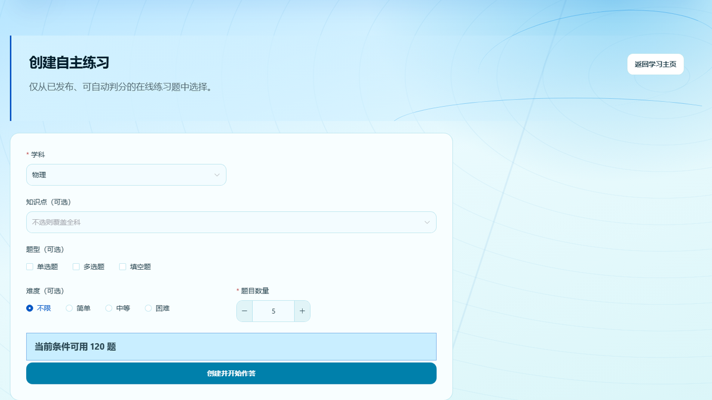](docs/evidence/thesis-final/04-practice.png)

### 功能说明

学生按学科、知识点、题型、难度和数量创建自主练习。系统只抽取授权范围内的已发布、可自动判分题，并在练习中冻结题干、选项、答案与解析版本。

### 设计思路

冻结快照避免题库后续编辑改变历史答题事实；所有权校验确保学生只能访问本人的练习会话。单选、多选和填空由共享确定性判分器处理，不调用 AI 决定分数。

实现与数据库映射

- 前端路由：`/student/practice/new`、`/student/practice/:id`
- Vue 页面或组件：[`PracticeNewView.vue`](https://github.com/Fiesty-Abyss/rike-tiku/blob/feat/final-product-completion/rike-tiku-frontend/src/views/student/PracticeNewView.vue)、[`PracticeSessionView.vue`](https://github.com/Fiesty-Abyss/rike-tiku/blob/feat/final-product-completion/rike-tiku-frontend/src/views/student/PracticeSessionView.vue)
- TypeScript API：[`student/practice.ts`](https://github.com/Fiesty-Abyss/rike-tiku/blob/feat/final-product-completion/rike-tiku-frontend/src/api/student/practice.ts)
- 后端 Controller：[`StudentPracticeController.java`](https://github.com/Fiesty-Abyss/rike-tiku/blob/feat/final-product-completion/rike-tiku-backend/src/main/java/com/neu/riketiku/xueshenglianxi/StudentPracticeController.java)
- 后端 Service：[`StudentPracticeService.java`](https://github.com/Fiesty-Abyss/rike-tiku/blob/feat/final-product-completion/rike-tiku-backend/src/main/java/com/neu/riketiku/xueshenglianxi/StudentPracticeService.java)、[`ObjectiveAnswerGrader.java`](https://github.com/Fiesty-Abyss/rike-tiku/blob/feat/final-product-completion/rike-tiku-backend/src/main/java/com/neu/riketiku/xueshenglianxi/ObjectiveAnswerGrader.java)
- 主要数据库表：`ti_mu`、`lian_xi_hui_hua`、`lian_xi_ti_mu`、`xue_sheng_da_ti`
- Flyway：[`V7`](https://github.com/Fiesty-Abyss/rike-tiku/blob/feat/final-product-completion/rike-tiku-backend/src/main/resources/db/migration/V7__create_student_practice_and_wrong_question_tables.sql)
- 主要技术：事务、冻结快照、JSON 结构化答案、确定性判分

### 论文与参考

- 可用于论文第 4 章练习数据模型和第 5 章确定性判分。
- [MySQL 8.4 事务模型](https://dev.mysql.com/doc/refman/8.4/en/innodb-transaction-model.html)；[Spring Transaction Management](https://docs.spring.io/spring-framework/reference/data-access/transaction.html)。

## 4. STANDARD 与结果

[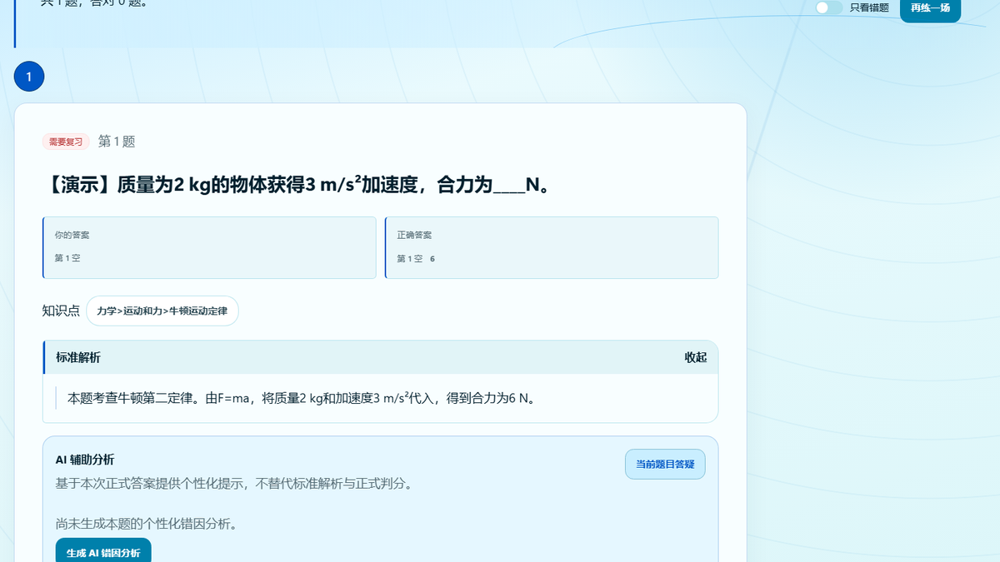](docs/evidence/thesis-final/05-result-standard.png)

### 功能说明

提交后页面对照学生答案与确定性正确答案，并默认展示 STANDARD 解析和知识点。STANDARD 是经过审核、随练习冻结的正式事实，不由 AI 生成结果覆盖。

### 设计思路

把正式答案、解析与 AI 辅助拆开，是系统最重要的可信边界。即使 Provider 未配置或调用失败，分数、正确答案和 STANDARD 仍完整可用。

实现与数据库映射

- 前端路由：`/student/practice/:id/result`
- Vue 页面或组件：[`PracticeResultView.vue`](https://github.com/Fiesty-Abyss/rike-tiku/blob/feat/final-product-completion/rike-tiku-frontend/src/views/student/PracticeResultView.vue)、[`StandardAnalysis.vue`](https://github.com/Fiesty-Abyss/rike-tiku/blob/feat/final-product-completion/rike-tiku-frontend/src/components/question/StandardAnalysis.vue)、[`AnswerDisplay.vue`](https://github.com/Fiesty-Abyss/rike-tiku/blob/feat/final-product-completion/rike-tiku-frontend/src/components/question/AnswerDisplay.vue)
- TypeScript API：[`student/practice.ts`](https://github.com/Fiesty-Abyss/rike-tiku/blob/feat/final-product-completion/rike-tiku-frontend/src/api/student/practice.ts)
- 后端 Controller：[`StudentPracticeController.java`](https://github.com/Fiesty-Abyss/rike-tiku/blob/feat/final-product-completion/rike-tiku-backend/src/main/java/com/neu/riketiku/xueshenglianxi/StudentPracticeController.java)
- 后端 Service：[`StudentPracticeService.java`](https://github.com/Fiesty-Abyss/rike-tiku/blob/feat/final-product-completion/rike-tiku-backend/src/main/java/com/neu/riketiku/xueshenglianxi/StudentPracticeService.java)
- 主要数据库表：`ti_mu_jie_xi`、`lian_xi_ti_mu`、`xue_sheng_da_ti`、`xue_xi_jie_guo`
- Flyway：[`V2`](https://github.com/Fiesty-Abyss/rike-tiku/blob/feat/final-product-completion/rike-tiku-backend/src/main/resources/db/migration/V2__create_question_core_tables.sql)、[`V7`](https://github.com/Fiesty-Abyss/rike-tiku/blob/feat/final-product-completion/rike-tiku-backend/src/main/resources/db/migration/V7__create_student_practice_and_wrong_question_tables.sql)
- 主要技术：版本冻结、KaTeX、安全科学文本、确定性 JSON 判分

### 论文与参考

- 可用于论文第 5 章结果反馈和第 6 章 AI/正式事实边界。
- 正式论文引用：[生成式人工智能的有限能力与教育变革（白名单 [1]）](docs/THESIS_REFERENCES.md#正式参考文献白名单)；[人机协同评价（白名单 [9]）](https://doi.org/10.13927/j.cnki.yuan.20240422.001)。

## 5. AI 当前题答疑

[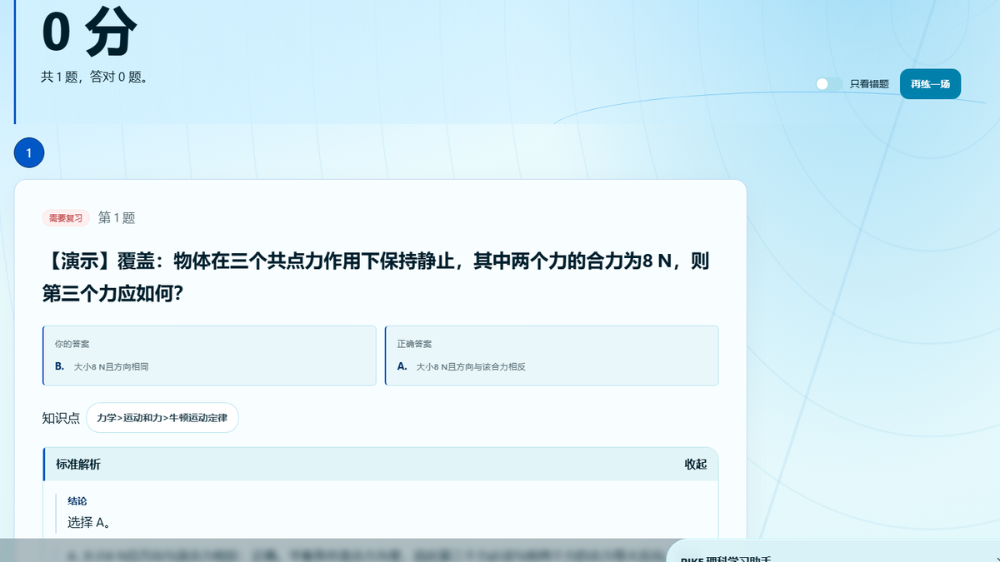](docs/evidence/thesis-final/08-student-ai-chat.png)

### 功能说明

学生可以围绕当前已提交题目开启有限会话，并选择管理员开放的模型、标准/深度思考和受控联网搜索。会话绑定冻结题干、学生答案、STANDARD 与知识点，最多 10 轮。

### 设计思路

模型只能读取当前学生有权访问的事实，不能选择任意 endpoint，也不能改写 STANDARD。搜索结果被标记为不可信补充上下文；最终页面不展示或保存 `reasoning_content`。

实现与数据库映射

- 前端路由：`/student/practice/:id/result`
- Vue 页面或组件：[`StudentAiLearningPanel.vue`](https://github.com/Fiesty-Abyss/rike-tiku/blob/feat/final-product-completion/rike-tiku-frontend/src/components/student/StudentAiLearningPanel.vue)
- TypeScript API：[`student/aiLearning.ts`](https://github.com/Fiesty-Abyss/rike-tiku/blob/feat/final-product-completion/rike-tiku-frontend/src/api/student/aiLearning.ts)
- 后端 Controller：[`StudentAiController.java`](https://github.com/Fiesty-Abyss/rike-tiku/blob/feat/final-product-completion/rike-tiku-backend/src/main/java/com/neu/riketiku/aixuesheng/StudentAiController.java)
- 后端 Service：[`StudentAiService.java`](https://github.com/Fiesty-Abyss/rike-tiku/blob/feat/final-product-completion/rike-tiku-backend/src/main/java/com/neu/riketiku/aixuesheng/StudentAiService.java)、[`OfficialWebSearchClient.java`](https://github.com/Fiesty-Abyss/rike-tiku/blob/feat/final-product-completion/rike-tiku-backend/src/main/java/com/neu/riketiku/ai/search/OfficialWebSearchClient.java)
- 主要数据库表：`ai_hui_hua`、`ai_xiao_xi`、`ai_mo_xing_pei_zhi`、`ai_diao_yong_ri_zhi`
- Flyway：[`V13`](https://github.com/Fiesty-Abyss/rike-tiku/blob/feat/final-product-completion/rike-tiku-backend/src/main/resources/db/migration/V13__create_student_ai_learning_tables.sql)、[`V15`](https://github.com/Fiesty-Abyss/rike-tiku/blob/feat/final-product-completion/rike-tiku-backend/src/main/resources/db/migration/V15__expand_student_ai_conversation_to_ten_rounds.sql)、[`V16`](https://github.com/Fiesty-Abyss/rike-tiku/blob/feat/final-product-completion/rike-tiku-backend/src/main/resources/db/migration/V16__add_student_ai_runtime_choices_and_search_usage.sql)
- 主要技术：DeepSeek Chat Completions、字符预算、Prompt 注入防护、metadata-only 日志、智谱 Web Search

### 论文与参考

- 可用于论文第 2 章智能辅导与个性化反馈、第 6 章受控 Provider 设计。
- 正式论文引用：[生成式 AI 教育应用及其规制（白名单 [10]）](docs/THESIS_REFERENCES.md#正式参考文献白名单)；[人机协同智能教学（白名单 [18]）](https://doi.org/10.16209/j.cnki.cust.2025.06.015)。

## 6. AI 变式练习

[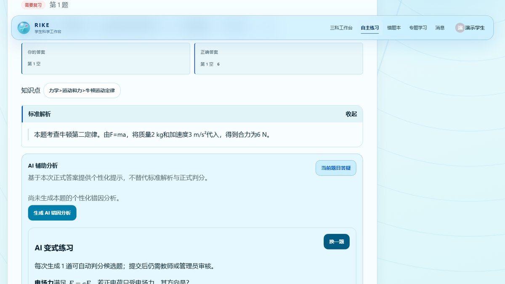](docs/evidence/thesis-final/09-student-ai-variant.png)

### 功能说明

学生可以基于已提交题目生成一题结构化变式，选择目标难度并完成单选、多选或填空作答。正确答案与解析在作答前隐藏；提交人工审核后仍保持 `PENDING`。

### 设计思路

生成结果必须通过共享 Parser 和确定性判分器，不能直接成为正式题库 STANDARD。母题、生成任务、实例和审核事实分开保存，使换题与失败均可追踪。

实现与数据库映射

- 前端路由：`/student/practice/:id/result`
- Vue 页面或组件：[`StudentAiVariantPanel.vue`](https://github.com/Fiesty-Abyss/rike-tiku/blob/feat/final-product-completion/rike-tiku-frontend/src/components/student/StudentAiVariantPanel.vue)
- TypeScript API：[`student/aiLearning.ts`](https://github.com/Fiesty-Abyss/rike-tiku/blob/feat/final-product-completion/rike-tiku-frontend/src/api/student/aiLearning.ts)
- 后端 Controller：[`StudentAiVariantController.java`](https://github.com/Fiesty-Abyss/rike-tiku/blob/feat/final-product-completion/rike-tiku-backend/src/main/java/com/neu/riketiku/aixuesheng/StudentAiVariantController.java)
- 后端 Service：[`StudentAiVariantService.java`](https://github.com/Fiesty-Abyss/rike-tiku/blob/feat/final-product-completion/rike-tiku-backend/src/main/java/com/neu/riketiku/aixuesheng/StudentAiVariantService.java)、[`AiQuestionGenerationService.java`](https://github.com/Fiesty-Abyss/rike-tiku/blob/feat/final-product-completion/rike-tiku-backend/src/main/java/com/neu/riketiku/aishengcheng/AiQuestionGenerationService.java)
- 主要数据库表：`ai_xue_sheng_bian_shi_shi_li`、`ai_sheng_cheng_ren_wu`、`ti_mu`、`ti_mu_shen_he_ji_lu`
- Flyway：[`V14`](https://github.com/Fiesty-Abyss/rike-tiku/blob/feat/final-product-completion/rike-tiku-backend/src/main/resources/db/migration/V14__create_ai_generation_and_model_tables.sql)、[`V19`](https://github.com/Fiesty-Abyss/rike-tiku/blob/feat/final-product-completion/rike-tiku-backend/src/main/resources/db/migration/V19__create_student_ai_variant_instances.sql)
- 主要技术：结构化生成、严格 Parser、内容 hash、事务、确定性判分、PENDING 人工门禁

### 论文与参考

- 可用于论文第 2 章自动出题、第 6 章结构化生成与第 7 章人工审核。
- 正式论文引用：[生成式人工智能对高等理科教育的影响（白名单 [11]）](docs/THESIS_REFERENCES.md#正式参考文献白名单)；[AI 支持的人机协同智能教学（白名单 [18]）](https://doi.org/10.16209/j.cnki.cust.2025.06.015)。

## 7. 教师任课工作台

[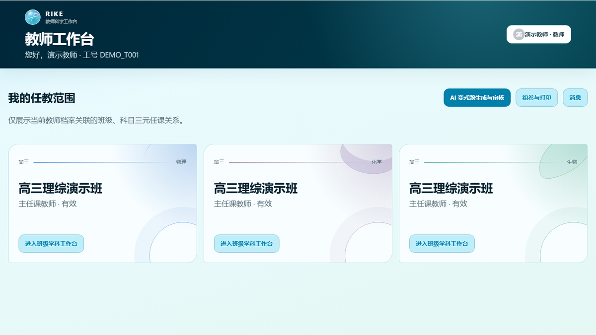](docs/evidence/thesis-final/11-teacher-workspace.png)

### 功能说明

教师工作台只展示本人 ACTIVE 任课关系关联的班级、科目和学生学习信息，并提供考点、组卷、消息和候选审核入口。不同班级与学科通过明确的任课范围隔离。

### 设计思路

权限基点不是前端选择项，而是服务端再次验证的“教师—班级—科目”三元关系。统计和内容查询都从同一范围出发，避免横向越权。

实现与数据库映射

- 前端路由：`/teacher/scopes/:scopeId`
- Vue 页面或组件：[`TeacherScopeWorkspaceView.vue`](https://github.com/Fiesty-Abyss/rike-tiku/blob/feat/final-product-completion/rike-tiku-frontend/src/views/teacher/TeacherScopeWorkspaceView.vue)
- TypeScript API：[`teacher.ts`](https://github.com/Fiesty-Abyss/rike-tiku/blob/feat/final-product-completion/rike-tiku-frontend/src/api/teacher.ts)
- 后端 Controller：[`JiaoShiGaoPinKaoDianController.java`](https://github.com/Fiesty-Abyss/rike-tiku/blob/feat/final-product-completion/rike-tiku-backend/src/main/java/com/neu/riketiku/jiaoshi/JiaoShiGaoPinKaoDianController.java)
- 后端 Service：[`JiaoShiGaoPinKaoDianFuWu.java`](https://github.com/Fiesty-Abyss/rike-tiku/blob/feat/final-product-completion/rike-tiku-backend/src/main/java/com/neu/riketiku/jiaoshi/JiaoShiGaoPinKaoDianFuWu.java)
- 主要数据库表：`jiao_shi_dang_an`、`ban_ji`、`ren_ke_guan_xi`、`gao_pin_kao_dian`
- Flyway：[`V6`](https://github.com/Fiesty-Abyss/rike-tiku/blob/feat/final-product-completion/rike-tiku-backend/src/main/resources/db/migration/V6__create_class_and_teaching_relationship_tables.sql)、[`V8`](https://github.com/Fiesty-Abyss/rike-tiku/blob/feat/final-product-completion/rike-tiku-backend/src/main/resources/db/migration/V8__create_high_frequency_point_table.sql)
- 主要技术：三元任课授权、ACTIVE scope、事务、聚合查询

### 论文与参考

- 可用于论文第 4 章组织模型和第 7 章应用层权限隔离。
- [MySQL 8.4 Foreign Key Constraints](https://dev.mysql.com/doc/refman/8.4/en/create-table-foreign-keys.html)；[Spring Method Security](https://docs.spring.io/spring-security/reference/servlet/authorization/method-security.html)。

## 8. 教师组卷

[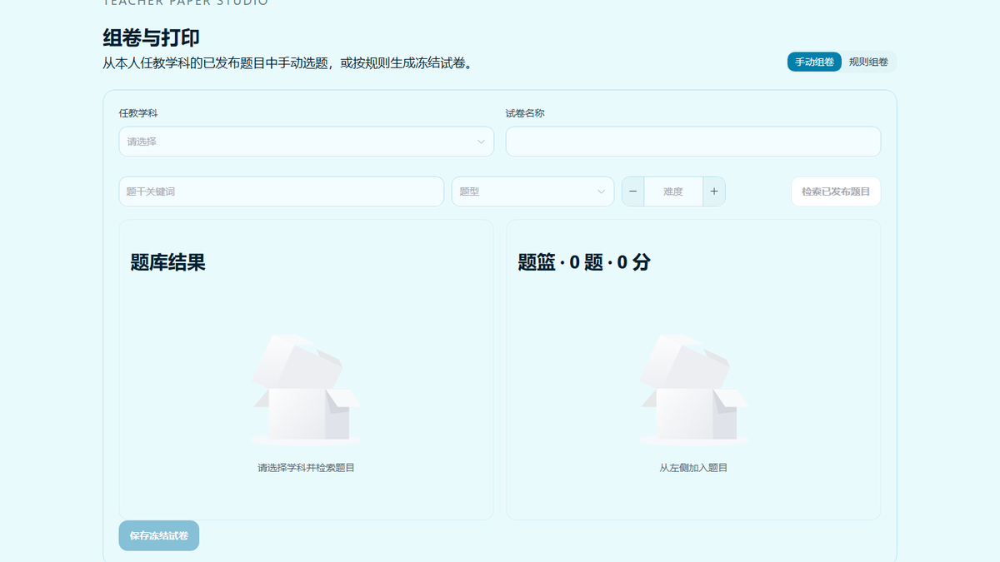](docs/evidence/thesis-final/13-teacher-paper-builder.png)

### 功能说明

教师可从本人任教学科的已发布题中手动组卷，也可按题型、难度、知识点和数量进行规则组卷。保存后冻结题序和分值，并分别生成学生版与答案解析版。

### 设计思路

组卷只消费正式 `PUBLISHED` 题目，试卷题目关系通过唯一约束保证顺序和题目不重复。打印采用浏览器 A4 样式，不额外引入 PDF 服务。

实现与数据库映射

- 前端路由：`/teacher/papers`
- Vue 页面或组件：[`TeacherPaperBuilderView.vue`](https://github.com/Fiesty-Abyss/rike-tiku/blob/feat/final-product-completion/rike-tiku-frontend/src/views/teacher/TeacherPaperBuilderView.vue)、[`PaperPreviewView.vue`](https://github.com/Fiesty-Abyss/rike-tiku/blob/feat/final-product-completion/rike-tiku-frontend/src/views/teacher/PaperPreviewView.vue)
- TypeScript API：[`teacher/papers.ts`](https://github.com/Fiesty-Abyss/rike-tiku/blob/feat/final-product-completion/rike-tiku-frontend/src/api/teacher/papers.ts)
- 后端 Controller：[`PaperController.java`](https://github.com/Fiesty-Abyss/rike-tiku/blob/feat/final-product-completion/rike-tiku-backend/src/main/java/com/neu/riketiku/shijuan/PaperController.java)
- 后端 Service：[`PaperService.java`](https://github.com/Fiesty-Abyss/rike-tiku/blob/feat/final-product-completion/rike-tiku-backend/src/main/java/com/neu/riketiku/shijuan/PaperService.java)
- 主要数据库表：`shi_juan`、`shi_juan_ti_mu`、`ti_mu`、`ti_mu_zhi_shi_dian`
- Flyway：[`V18`](https://github.com/Fiesty-Abyss/rike-tiku/blob/feat/final-product-completion/rike-tiku-backend/src/main/resources/db/migration/V18__create_teacher_papers.sql)
- 主要技术：规则过滤、冻结顺序/分值、唯一约束、CSS `@media print`

### 论文与参考

- 可用于论文第 5 章教师组卷工作流和第 4 章试卷关系模型。
- [MySQL 8.4 CHECK Constraints](https://dev.mysql.com/doc/refman/8.4/en/create-table-check-constraints.html)；[MDN Printing](https://developer.mozilla.org/en-US/docs/Web/CSS/CSS_media_queries/Printing)。

## 9. 管理员 AI 模型配置

[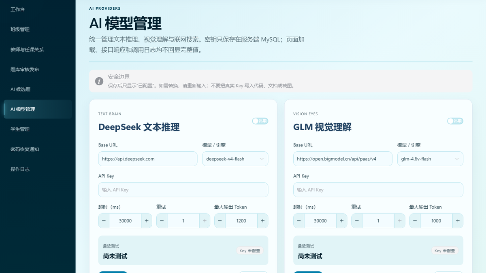](docs/evidence/thesis-final/17-admin-ai-models.png)

### 功能说明

管理员分别管理 TEXT、VISION 和 SEARCH 用途的受控配置。页面只显示 Key 是否已配置；连接测试返回安全状态、延迟和时间，不回显 Key、Base64、Prompt 或 Provider 原始响应。

### 设计思路

Provider 配置与学生业务 API 分离，前端只能提交受控模型 ID。DeepSeek 负责文本能力，GLM-4.6V-Flash负责视觉上下文，智谱 Web Search 提供结构化来源；未配置时确定性主链仍可运行。

实现与数据库映射

- 前端路由：`/admin/ai-models`
- Vue 页面或组件：[`AdminAiModelsView.vue`](https://github.com/Fiesty-Abyss/rike-tiku/blob/feat/final-product-completion/rike-tiku-frontend/src/views/admin/AdminAiModelsView.vue)
- TypeScript API：[`admin/aiModels.ts`](https://github.com/Fiesty-Abyss/rike-tiku/blob/feat/final-product-completion/rike-tiku-frontend/src/api/admin/aiModels.ts)
- 后端 Controller：[`AiModelConfigController.java`](https://github.com/Fiesty-Abyss/rike-tiku/blob/feat/final-product-completion/rike-tiku-backend/src/main/java/com/neu/riketiku/ai/admin/AiModelConfigController.java)
- 后端 Service：[`AiModelConfigService.java`](https://github.com/Fiesty-Abyss/rike-tiku/blob/feat/final-product-completion/rike-tiku-backend/src/main/java/com/neu/riketiku/ai/admin/AiModelConfigService.java)、[`AiProviderService.java`](https://github.com/Fiesty-Abyss/rike-tiku/blob/feat/final-product-completion/rike-tiku-backend/src/main/java/com/neu/riketiku/ai/AiProviderService.java)、[`GlmVisionProvider.java`](https://github.com/Fiesty-Abyss/rike-tiku/blob/feat/final-product-completion/rike-tiku-backend/src/main/java/com/neu/riketiku/ai/vision/GlmVisionProvider.java)
- 主要数据库表：`ai_mo_xing_pei_zhi`、`ai_diao_yong_ri_zhi`、`ai_shi_jue_shang_xia_wen`
- Flyway：[`V12`](https://github.com/Fiesty-Abyss/rike-tiku/blob/feat/final-product-completion/rike-tiku-backend/src/main/resources/db/migration/V12__create_ai_call_log.sql)、[`V14`](https://github.com/Fiesty-Abyss/rike-tiku/blob/feat/final-product-completion/rike-tiku-backend/src/main/resources/db/migration/V14__create_ai_generation_and_model_tables.sql)、[`V16`](https://github.com/Fiesty-Abyss/rike-tiku/blob/feat/final-product-completion/rike-tiku-backend/src/main/resources/db/migration/V16__add_student_ai_runtime_choices_and_search_usage.sql)
- 主要技术：DeepSeek Chat Completions、GLM-4.6V-Flash、智谱 Web Search、超时/重试、安全错误分类、metadata-only 日志

### 论文与参考

- 可用于论文第 3 章技术架构、第 6 章 Provider 边界和第 7 章隐私治理。
- [DeepSeek API](https://api-docs.deepseek.com/api/create-chat-completion)；[GLM-4.6V-Flash](https://docs.bigmodel.cn/cn/guide/models/free/glm-4.6v-flash)；[UNESCO 生成式 AI 教育指南](https://unesdoc.unesco.org/ark:/48223/pf0000386693)。

## 10. 错题筛选、再做与软归档

[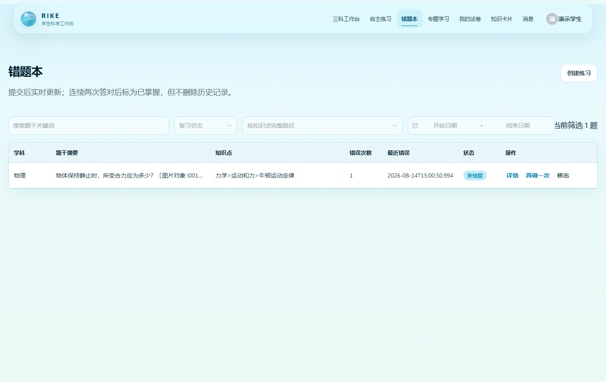](docs/evidence/thesis-final/27-wrong-question-review.png)

### 功能说明

学生可按学科、知识点稳定 ID、状态和关键词筛选错题，并发起冻结单题的“再做一次”。做对后可软归档，历史答题、错误次数、掌握度与 AI 分析不会被删除，再次做错会重新激活。

### 设计思路

归档是学习状态而非数据删除；所有学生与 AI 可见题干统一清除经 Demo 标识确认的内部前缀，不误删“覆盖率”“覆盖范围”等正常正文。

### 实现映射

| 层次 | 精确实现 |
|---|---|
| 路由 / Vue | [`/student/wrong-questions` · `WrongQuestionsView.vue`](rike-tiku-frontend/src/views/student/WrongQuestionsView.vue) |
| TypeScript API | [`student/practice.ts`](rike-tiku-frontend/src/api/student/practice.ts) |
| Controller / Service | [`StudentPracticeController.java`](rike-tiku-backend/src/main/java/com/neu/riketiku/xueshenglianxi/StudentPracticeController.java) · [`StudentPracticeService.java`](rike-tiku-backend/src/main/java/com/neu/riketiku/xueshenglianxi/StudentPracticeService.java) |
| 表 / Flyway | `cuo_ti_ji_lu`、`lian_xi_hui_hua`、`xue_sheng_da_ti` · [`V7`](rike-tiku-backend/src/main/resources/db/migration/V7__create_student_practice_and_wrong_question_tables.sql) |
| 测试 / 技术 | [`StudentPracticeIntegrationTest.java`](rike-tiku-backend/src/test/java/com/neu/riketiku/xueshenglianxi/StudentPracticeIntegrationTest.java) · 软归档、冻结快照、确定性判分 |

### 论文写作提示与参考

可用于第 4 章学习事实生命周期与第 5 章复习闭环；不能把归档写成删除历史。[MySQL 事务模型](https://dev.mysql.com/doc/refman/8.4/en/innodb-transaction-model.html)。

## 11. 综合题专题单元与附件

[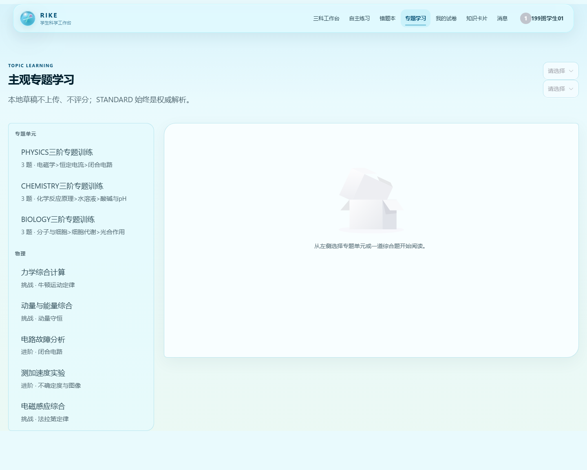](docs/evidence/thesis-final/28-topic-units.png)

### 功能说明

专题单元引用既有 `SUBJECTIVE + TOPIC_LEARNING` 题，按基础理解、情境迁移和综合提升三题组织；当前正式内容为 15 个单元、45 道原创计算/实验/流程/材料分析/综合大题。支持题干/解析附件、本地草稿、STANDARD、专题答疑和待审核专题变式。主观题不自动评分，草稿不上传。

### 实现映射

| 层次 | 精确实现 |
|---|---|
| 路由 / Vue / API | [`TopicLearningView.vue`](rike-tiku-frontend/src/views/student/TopicLearningView.vue) · [`topicLearning.ts`](rike-tiku-frontend/src/api/student/topicLearning.ts) |
| Controller / Service | [`TopicLearningController.java`](rike-tiku-backend/src/main/java/com/neu/riketiku/zhuantixuexi/TopicLearningController.java) · [`TopicLearningService.java`](rike-tiku-backend/src/main/java/com/neu/riketiku/zhuantixuexi/TopicLearningService.java) |
| 表 / Flyway | `zhuan_ti_xue_xi_dan_yuan`、`zhuan_ti_xue_xi_dan_yuan_ti_mu`、`ti_mu_fu_jian` · [`V26`](rike-tiku-backend/src/main/resources/db/migration/V26__add_topic_units_and_xai_vision_provider.sql) |
| 测试 / 技术 | [`TopicLearningIntegrationTest.java`](rike-tiku-backend/src/test/java/com/neu/riketiku/zhuantixuexi/TopicLearningIntegrationTest.java) · 应用层范围授权、安全附件、KaTeX |

### 论文写作提示与参考

可用于第 4 章专题单元模型与第 6 章多模态边界；不能声称 AI 对主观题评分。[UNESCO 生成式 AI 教育指南](https://unesdoc.unesco.org/ark:/48223/pf0000386693)。

## 12. 私信、撤回与仅本人删除

[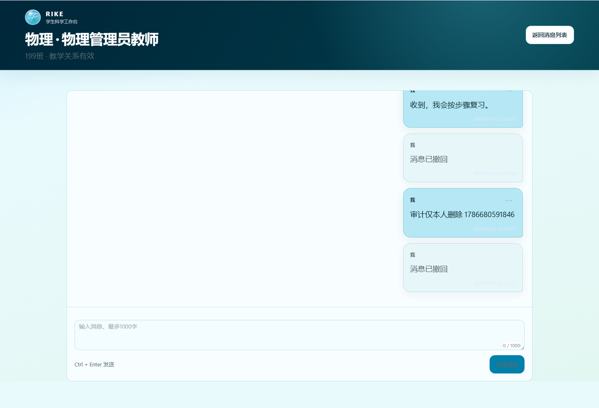](docs/evidence/thesis-final/31-message-actions.png)

### 功能说明

发送者可在服务端五分钟窗口内撤回，双方均看到中性占位；任一参与者可仅从自己的列表隐藏消息，不影响对方和数据库审计事实。操作菜单使用居中的确认框，并明确两种语义。

### 实现映射

| 层次 | 精确实现 |
|---|---|
| 路由 / Vue / API | [`MessageConversationView.vue`](rike-tiku-frontend/src/views/messages/MessageConversationView.vue) · [`messages.ts`](rike-tiku-frontend/src/api/messages.ts) |
| Controller / Service | [`SiXinController.java`](rike-tiku-backend/src/main/java/com/neu/riketiku/sixin/SiXinController.java) · [`SiXinFuWu.java`](rike-tiku-backend/src/main/java/com/neu/riketiku/sixin/SiXinFuWu.java) |
| 表 / Flyway | `si_xin_hui_hua`、`si_xin_xiao_xi` · [`V22`](rike-tiku-backend/src/main/resources/db/migration/V22__add_message_recall_and_per_user_hiding.sql) |
| 测试 / 技术 | [`MessageConversationView.spec.ts`](rike-tiku-frontend/src/views/messages/MessageConversationView.spec.ts) · 软隐藏、服务端时间、幂等冲突 |

### 论文写作提示与参考

可用于第 5 章通信交互和第 7 章审计保留；不能描述为物理删除。[OWASP Logging Cheat Sheet](https://cheatsheetseries.owasp.org/cheatsheets/Logging_Cheat_Sheet.html)。

## 13. 教师班级私有题库

[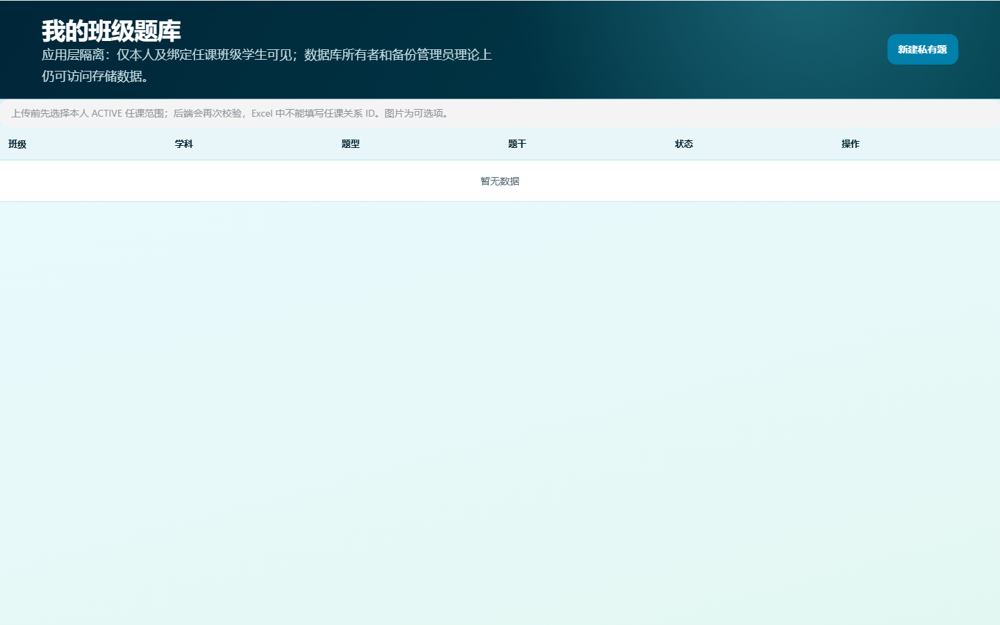](docs/evidence/thesis-final/32-private-question-bank.png)

### 功能说明

教师选择本人 ACTIVE 任课范围后新建、导入、编辑并发布班级私有题。学生仅能看到主班级与对应科目的私有 `PUBLISHED` 题；其他班级、其他教师及管理员普通题库 API 不返回其内容。

### 实现映射

| 层次 | 精确实现 |
|---|---|
| 路由 / Vue / API | [`TeacherPrivateQuestionBankView.vue`](rike-tiku-frontend/src/views/teacher/TeacherPrivateQuestionBankView.vue) · [`privateQuestions.ts`](rike-tiku-frontend/src/api/teacher/privateQuestions.ts) |
| Controller / Service | [`TeacherPrivateQuestionController.java`](rike-tiku-backend/src/main/java/com/neu/riketiku/tiku/teacher/TeacherPrivateQuestionController.java) · [`TeacherPrivateQuestionService.java`](rike-tiku-backend/src/main/java/com/neu/riketiku/tiku/teacher/TeacherPrivateQuestionService.java) |
| 表 / Flyway | `ti_mu`、`ren_ke_guan_xi`、`ti_mu_fu_jian` · [`V20`](rike-tiku-backend/src/main/resources/db/migration/V20__add_scoped_questions_and_topic_categories.sql) |
| 测试 / 技术 | [`UserTeachingDatabaseModelTest.java`](rike-tiku-backend/src/test/java/com/neu/riketiku/zhanghao/UserTeachingDatabaseModelTest.java) · 服务端范围复核、404 防枚举、安全下载 |

### 论文写作提示与参考

可用于第 4 章范围模型与第 7 章横向越权防护；这是应用层隔离，不是对数据库所有者的密码学不可见。[Spring Method Security](https://docs.spring.io/spring-security/reference/servlet/authorization/method-security.html)。

## 14. 试卷发布、学生提交与画像

[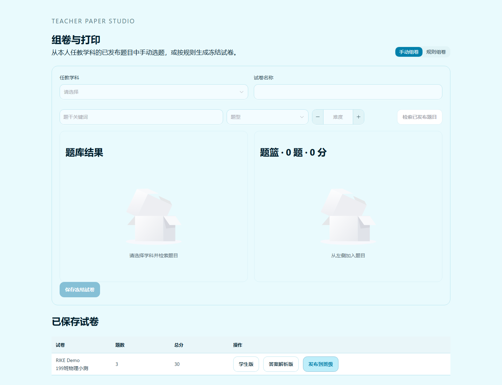](docs/evidence/thesis-final/34-paper-publish-quality.png)

### 功能说明

教师把 READY 试卷发布到本人任课班级；系统冻结题目、选项、分值、答案、STANDARD 与附件元数据。手动组卷可加入已发布专题主观大题；学生自动保存草稿并幂等提交，客观题确定性判分，主观题保存为待人工处理且不计入自动得分；教师查看 SQL/规则计算的班级统计和学生画像。

### 实现映射

| 层次 | 精确实现 |
|---|---|
| 路由 / Vue / API | [`TeacherPaperBuilderView.vue`](rike-tiku-frontend/src/views/teacher/TeacherPaperBuilderView.vue)、[`StudentPapersView.vue`](rike-tiku-frontend/src/views/student/StudentPapersView.vue) · [`teacher/papers.ts`](rike-tiku-frontend/src/api/teacher/papers.ts)、[`student/papers.ts`](rike-tiku-frontend/src/api/student/papers.ts) |
| Controller / Service | [`PaperAssignmentTeacherController.java`](rike-tiku-backend/src/main/java/com/neu/riketiku/shijuan/PaperAssignmentTeacherController.java) · [`PaperAssignmentStudentController.java`](rike-tiku-backend/src/main/java/com/neu/riketiku/shijuan/PaperAssignmentStudentController.java) · [`PaperAssignmentService.java`](rike-tiku-backend/src/main/java/com/neu/riketiku/shijuan/PaperAssignmentService.java) |
| 表 / Flyway | `shi_juan_fa_bu`、`shi_juan_fa_bu_ti_mu`、`shi_juan_ti_jiao`、`shi_juan_xue_sheng_da_ti` · [`V27`](rike-tiku-backend/src/main/resources/db/migration/V27__add_paper_publication_and_student_submissions.sql) |
| 测试 / 技术 | [`PaperAssignmentIntegrationTest.java`](rike-tiku-backend/src/test/java/com/neu/riketiku/shijuan/PaperAssignmentIntegrationTest.java) · 冻结快照、幂等、确定性判分、SQL 聚合 |

### 论文写作提示与参考

可用于第 4 章试卷事实模型、第 5 章发布链及第 6 章 AI 辅助质量建议；AI 不改题、不改分、不发布。[Spring Transaction Management](https://docs.spring.io/spring-framework/reference/data-access/transaction.html)。

## 15. 知识卡片、零基础讲解与生成练习

[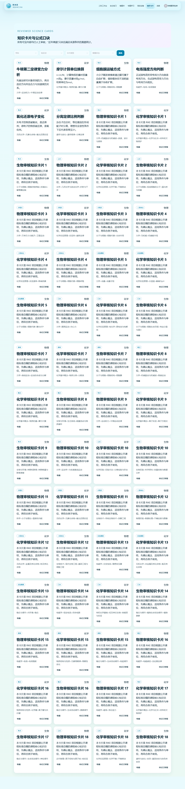](docs/evidence/thesis-final/30-knowledge-cards.png)

### 功能说明

学生按学科、知识点和类型查看经审核的公式、方程式、二级结论、仪器、口诀、表格与笔记，并可收藏、标记掌握、请求零基础讲解或生成临时练习。生成题复用统一 Candidate Schema、Parser、新颖度和 PENDING 审核链。

### 实现映射

| 层次 | 精确实现 |
|---|---|
| 路由 / Vue / API | [`StudentKnowledgeCardsView.vue`](rike-tiku-frontend/src/views/student/StudentKnowledgeCardsView.vue) · [`knowledgeCards.ts`](rike-tiku-frontend/src/api/student/knowledgeCards.ts) |
| Controller / Service | [`KnowledgeCardStudentController.java`](rike-tiku-backend/src/main/java/com/neu/riketiku/zhishikapian/KnowledgeCardStudentController.java) · [`KnowledgeCardService.java`](rike-tiku-backend/src/main/java/com/neu/riketiku/zhishikapian/KnowledgeCardService.java) · [`KnowledgeCardPracticeService.java`](rike-tiku-backend/src/main/java/com/neu/riketiku/zhishikapian/KnowledgeCardPracticeService.java) |
| 表 / Flyway | `gao_pin_kao_dian`、`gao_pin_kao_dian_shen_he_ji_lu`、`xue_sheng_zhi_shi_ka_pian_zhuang_tai`、`zhi_shi_ka_pian_lian_xi_shi_li` · [`V28`](rike-tiku-backend/src/main/resources/db/migration/V28__complete_reviewed_science_cards.sql)、[`V29`](rike-tiku-backend/src/main/resources/db/migration/V29__add_knowledge_card_practice_instances.sql) |
| 测试 / 技术 | [`KnowledgeCardIntegrationTest.java`](rike-tiku-backend/src/test/java/com/neu/riketiku/zhishikapian/KnowledgeCardIntegrationTest.java)、[`KnowledgeCardPracticeIntegrationTest.java`](rike-tiku-backend/src/test/java/com/neu/riketiku/zhishikapian/KnowledgeCardPracticeIntegrationTest.java) · KaTeX、人工审核、确定性判分 |

### 论文写作提示与参考

可用于第 5 章知识支架和第 6 章受控生成；近年高频只由有年份、合法来源、非 Demo/AI 的真题统计，样本不足时不让 AI 猜测。[教育部普通高中课程方案和课程标准](http://www.moe.gov.cn/srcsite/A26/s8001/202006/t20200603_462199.html)。

## 16. 操作日志检索与导出

[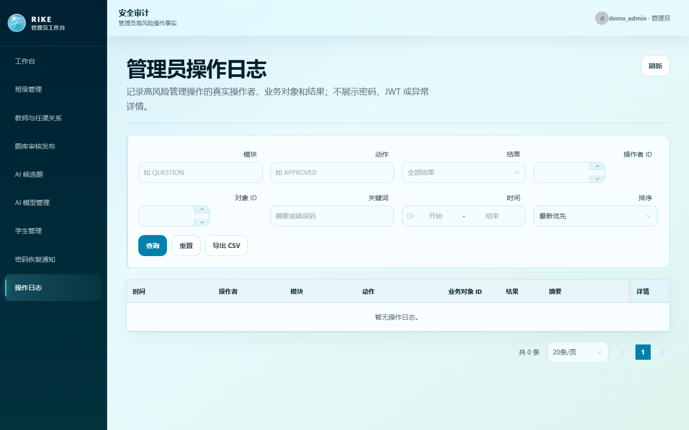](docs/evidence/thesis-final/35-operation-log-search.png)

### 功能说明

管理员按日期、操作者、模块、动作、结果、业务对象和关键词分页检索 append-only 日志并受控导出。页面不会一次加载全部日志，也不提供修改单条历史的接口。

### 实现映射

| 层次 | 精确实现 |
|---|---|
| 路由 / Vue / API | [`OperationLogsView.vue`](rike-tiku-frontend/src/views/admin/OperationLogsView.vue) · [`operationLogs.ts`](rike-tiku-frontend/src/api/admin/operationLogs.ts) |
| Controller / Service | [`GuanLiCaoZuoRiZhiController.java`](rike-tiku-backend/src/main/java/com/neu/riketiku/guanlicaozuorizhi/GuanLiCaoZuoRiZhiController.java) · [`GuanLiCaoZuoRiZhiFuWu.java`](rike-tiku-backend/src/main/java/com/neu/riketiku/guanlicaozuorizhi/GuanLiCaoZuoRiZhiFuWu.java) |
| 表 / Flyway | `guan_li_cao_zuo_ri_zhi` · [`V11`](rike-tiku-backend/src/main/resources/db/migration/V11__create_admin_operation_log.sql) |
| 测试 / 技术 | [`GuanLiCaoZuoRiZhiIntegrationTest.java`](rike-tiku-backend/src/test/java/com/neu/riketiku/guanlicaozuorizhi/GuanLiCaoZuoRiZhiIntegrationTest.java) · append-only、分页、CSV |

### 论文写作提示与参考

可用于第 7 章可追责性；日志不保存密码、Key、Prompt、答案正文或 Base64。[OWASP Logging Cheat Sheet](https://cheatsheetseries.owasp.org/cheatsheets/Logging_Cheat_Sheet.html)。

## 17. 管理员学生导入与题库审核

[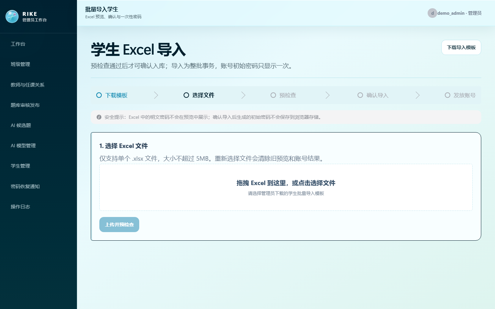](docs/evidence/thesis-final/37-student-import.png)

### 功能说明

学生导入采用精确 7 列模板，题库导入采用精确 19 列模板；Preview 不写库，Confirm 重新解析、校验文件 hash 并以单事务写入。题目导入后只能进入 PENDING，必须人工审核后才能 PUBLISHED。

### 实现映射

| 层次 | 精确实现 |
|---|---|
| 路由 / Vue / API | [`StudentImportView.vue`](rike-tiku-frontend/src/views/admin/StudentImportView.vue) · [`admin/studentImport.ts`](rike-tiku-frontend/src/api/admin/studentImport.ts) |
| Controller / Service | [`StudentImportController.java`](rike-tiku-backend/src/main/java/com/neu/riketiku/xueshengdaoru/StudentImportController.java) · [`StudentImportService.java`](rike-tiku-backend/src/main/java/com/neu/riketiku/xueshengdaoru/StudentImportService.java) |
| 表 / Flyway | `dao_ru_pi_ci`、`ti_mu`、`ti_mu_shen_he_ji_lu`、`yong_hu`、`xue_sheng_dang_an` · [`V2`](rike-tiku-backend/src/main/resources/db/migration/V2__create_question_core_tables.sql)、[`V5`](rike-tiku-backend/src/main/resources/db/migration/V5__create_user_role_and_profile_tables.sql) |
| 测试 / 技术 | [`FinalImportTemplatesIntegrationTest.java`](rike-tiku-backend/src/test/java/com/neu/riketiku/tiku/daoru/FinalImportTemplatesIntegrationTest.java) · Apache POI、SHA-256、Preview/Confirm、事务 |

### 论文写作提示与参考

可用于第 5 章批量导入与第 7 章来源/权利门禁；Excel 导入不会训练模型。[Apache POI 官方文档](https://poi.apache.org/components/spreadsheet/)。

## 18. 多视觉 Provider 显式配置

### 功能说明

管理员可分别配置 GLM 与 xAI 的 VISION 模型、超时和受控模型代码，并显式选择当前 Provider；系统不隐式自动切换。配置页只显示 Key 是否存在，诊断区分认证、限流、参数、模型、账户、超时与响应结构错误。

### 实现映射

| 层次 | 精确实现 |
|---|---|
| 路由 / Vue / API | [`AdminAiModelsView.vue`](rike-tiku-frontend/src/views/admin/AdminAiModelsView.vue) · [`aiModels.ts`](rike-tiku-frontend/src/api/admin/aiModels.ts) |
| Controller / Service | [`AiModelConfigController.java`](rike-tiku-backend/src/main/java/com/neu/riketiku/ai/admin/AiModelConfigController.java) · [`AiModelConfigService.java`](rike-tiku-backend/src/main/java/com/neu/riketiku/ai/admin/AiModelConfigService.java) |
| 表 / Flyway | `ai_mo_xing_pei_zhi`、`ai_diao_yong_ri_zhi`、`ai_shi_jue_shang_xia_wen` · [`V26`](rike-tiku-backend/src/main/resources/db/migration/V26__add_topic_units_and_xai_vision_provider.sql) |
| 测试 / 技术 | [`GlmVisionProviderTest.java`](rike-tiku-backend/src/test/java/com/neu/riketiku/ai/vision/GlmVisionProviderTest.java)、[`XaiVisionProviderTest.java`](rike-tiku-backend/src/test/java/com/neu/riketiku/ai/vision/XaiVisionProviderTest.java) · OpenAI-compatible 消息、raw Base64、安全错误映射、metadata-only 日志 |

### 论文写作提示与参考

可用于第 6 章可插拔 Provider 和降级设计；Mock 合同测试不等于真实调用。[智谱 GLM-4.6V-Flash](https://docs.bigmodel.cn/cn/guide/models/free/glm-4.6v-flash)；[xAI Vision](https://docs.x.ai/docs/guides/image-understanding)。

## 工程、数据库与论文导航

- 技术栈：Java 25、Spring Boot 4.1、Vue 3、TypeScript、MySQL 8.4、Flyway V1–V30。
- 数据模型：50 张业务表；[字段/约束参考](docs/DATABASE_SCHEMA_REFERENCE.md)、[V29 历史纯结构快照](database/schema_snapshot_v29.sql)、[ER 模块图](database/diagrams/rike_tiku_er.md)。
- Excel：[学生模板](docs/templates/student-import-template.xlsx)、[题目19列模板](docs/templates/question-import-template.xlsx)、[Preview/Confirm 指南](docs/EXCEL_IMPORT_GUIDE.md)。
- 论文：[写作资料中心](docs/THESIS_WRITING_HUB.md)、[论文初稿](docs/thesis/RIKE_THESIS_DRAFT.md)、[事实核对表](docs/thesis/RIKE_THESIS_FACT_CHECK.md)、[答辩提纲](docs/thesis/RIKE_DEFENSE_OUTLINE.md)。
- 正式论文唯一白名单：[22条正式参考文献](docs/THESIS_REFERENCES.md)；正式引用管理：[references.bib](docs/references/references.bib)。扩展工程调研已物理隔离到 [research-only](docs/references/research-only/README.md)，不得作为开题报告或毕业论文正式引用。文献只用于说明研究与设计依据，不代表 RIKE 自身实验结果。

真实 Provider 状态以当前验收记录为准：DeepSeek variant、DeepSeek tutor、GLM Vision、xAI Vision、Web Search 均因没有可安全使用的轮换后凭据而为 `BLOCKED_EXTERNAL_PROVIDER`；Mock/Fake 只用于自动化，不记作真实调用。人工验收状态为 `FINAL_USER_REVIEW_PENDING`。
