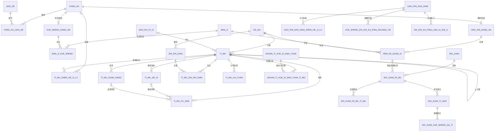
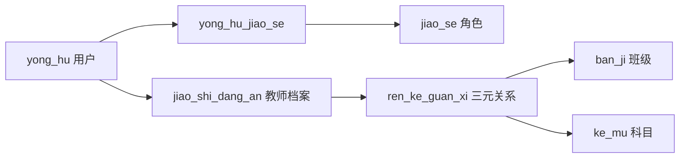

# `rike_tiku` 核心ER图

以下图用于阅读和论文说明；外键、索引、检查约束的最终事实以Flyway迁移和真实结构快照为准。

## V29 结构口径

当前结构为 Flyway V1–V29、50 张业务表。V25 保存候选题新颖度审计元数据；V26 增加专题单元并扩展显式 GLM/xAI 视觉配置；V27 增加试卷发布快照、学生提交和逐题事实；V28 完成知识卡片审核与学生状态；V29 增加知识卡片生成练习实例。纯结构细节见 [`schema_snapshot_v29.sql`](../schema_snapshot_v29.sql)。

## 权限数据路径

教师对班级和科目的数据范围必须落到一条明确的 `ren_ke_guan_xi`，不能通过姓名、职务或两个独立关系的笛卡尔组合推断。
