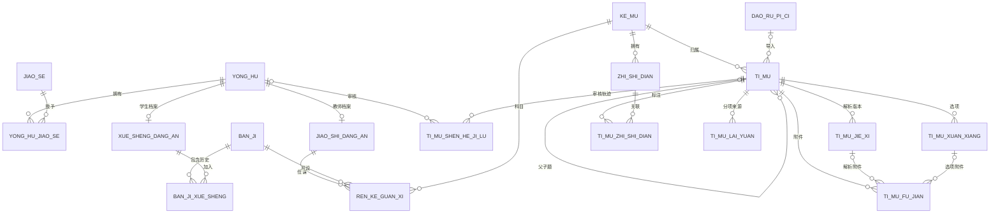
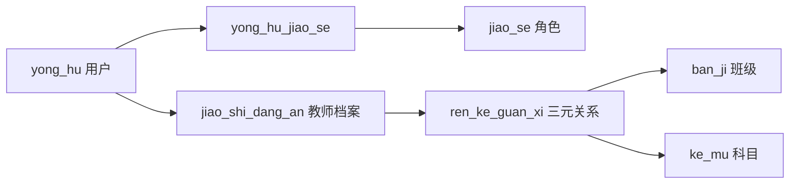

# `rike_tiku` 核心ER图

以下图用于阅读和论文说明；外键、索引、检查约束的最终事实以Flyway迁移和真实结构快照为准。

```mermaid
erDiagram
    YONG_HU ||--o{ YONG_HU_JIAO_SE : "拥有"
    JIAO_SE ||--o{ YONG_HU_JIAO_SE : "授予"
    YONG_HU ||--o| XUE_SHENG_DANG_AN : "学生档案"
    YONG_HU ||--o| JIAO_SHI_DANG_AN : "教师档案"
    BAN_JI ||--o{ BAN_JI_XUE_SHENG : "包含历史"
    XUE_SHENG_DANG_AN ||--o{ BAN_JI_XUE_SHENG : "加入"
    JIAO_SHI_DANG_AN ||--o{ REN_KE_GUAN_XI : "任课"
    BAN_JI ||--o{ REN_KE_GUAN_XI : "开设"
    KE_MU ||--o{ REN_KE_GUAN_XI : "科目"
    YONG_HU o|--o{ TI_MU_SHEN_HE_JI_LU : "审核"

    KE_MU ||--o{ ZHI_SHI_DIAN : "拥有"
    KE_MU ||--o{ TI_MU : "归属"
    DAO_RU_PI_CI o|--o{ TI_MU : "导入"
    TI_MU o|--o{ TI_MU : "父子题"
    TI_MU ||--o{ TI_MU_XUAN_XIANG : "选项"
    TI_MU ||--o{ TI_MU_JIE_XI : "解析版本"
    TI_MU ||--o{ TI_MU_ZHI_SHI_DIAN : "标注"
    ZHI_SHI_DIAN ||--o{ TI_MU_ZHI_SHI_DIAN : "关联"
    TI_MU ||--o{ TI_MU_FU_JIAN : "附件"
    TI_MU_JIE_XI o|--o{ TI_MU_FU_JIAN : "解析附件"
    TI_MU_XUAN_XIANG o|--o{ TI_MU_FU_JIAN : "选项附件"
    TI_MU ||--o{ TI_MU_LAI_YUAN : "分项来源"
    TI_MU ||--o{ TI_MU_SHEN_HE_JI_LU : "审核轨迹"
```

## 权限数据路径

```mermaid
flowchart LR
    U["yong_hu 用户"] --> UR["yong_hu_jiao_se"] --> R["jiao_se 角色"]
    U --> TP["jiao_shi_dang_an 教师档案"]
    TP --> REL["ren_ke_guan_xi 三元关系"]
    REL --> C["ban_ji 班级"]
    REL --> S["ke_mu 科目"]
```

教师对班级和科目的数据范围必须落到一条明确的 `ren_ke_guan_xi`，不能通过姓名、职务或两个独立关系的笛卡尔组合推断。
