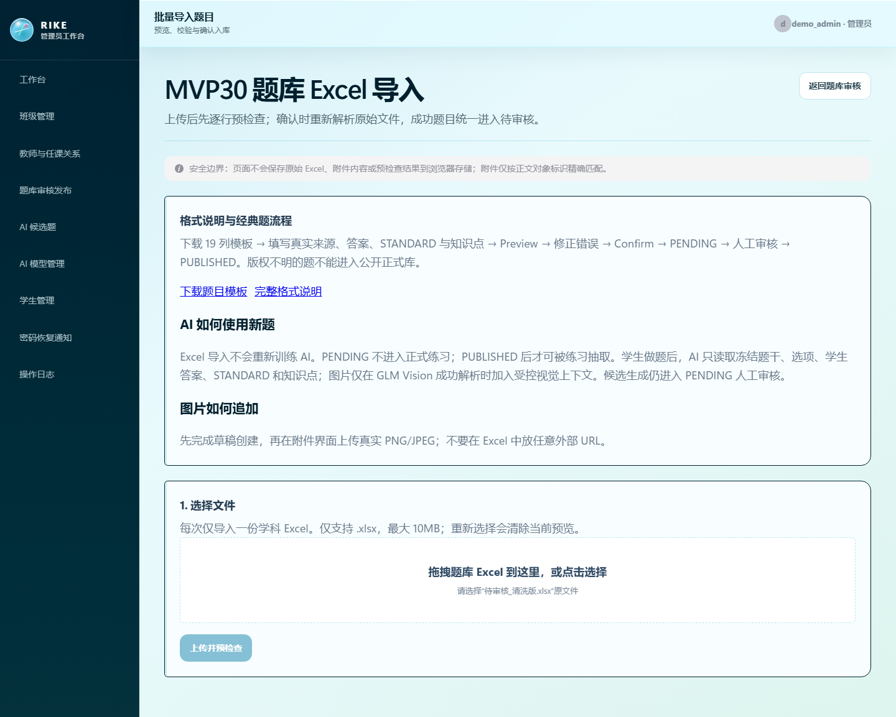

# Excel 批量导入实现指南

本文逐项对照当前 `StudentExcelTemplate`、`StudentImportService`、`StudentImportConfirmService`、`QuestionImportService` 与集成测试；不是旧设计稿的字段推测。模板：[学生模板](templates/student-import-template.xlsx) · [题目模板](templates/question-import-template.xlsx)。

## 1 分钟快速开始

### 学生导入

1. 下载[学生模板](templates/student-import-template.xlsx)，只修改第 2 行及之后的数据行。
2. 保留 Sheet 名 `学生导入` 和全部 7 个表头，不插列、不加公式。
3. 上传后先执行 Preview，逐行修正错误，再 Confirm。
4. Confirm 成功后仅在当次受控响应中安全交付初始密码；不要截图、复制到仓库或发到非安全渠道。


图：学生批量导入页面。实际模板的 Sheet 名和 7 个表头不可修改；页面截图是历史原始证据，模板文件才是字段的精确事实。

### 题目导入

1. 下载[题目 19 列模板](templates/question-import-template.xlsx)，一个文件只放一个学科。
2. 保留 `题目检查` Sheet、第 1 行说明和第 2 行精确表头；数据从第 3 行开始。
3. 填写数据库已有的完整知识点路径；图片使用对象标记，来源文件必须位于受控根且存在。
4. Preview 后再 Confirm；所有题及 STANDARD 均先进入 `PENDING`，必须人工审核才可 `PUBLISHED`。



图：题目导入页面。19 列模板与来源/附件校验由服务端执行，Excel 中的“审核状态”不能绕过状态机。

### Preview → Confirm 的真实语义

```text
Excel → Preview（表头、枚举、数据库冲突、附件、来源、hash 校验；不写库）
      → 用户修正并确认
      → Confirm（再次完整解析和校验；事务写库）
      → 学生账号创建 / 题目与 STANDARD PENDING
```

Confirm 不信任旧 Preview 结果：同一文件仍会被重新解析、重新计算 hash；任何无效行或并发完整性冲突均使整批事务回滚。

## 学生导入：固定 7 列

- 接口：`GET /api/v1/admin/student-import/template`、`POST /api/v1/admin/student-import/preview`、`POST /api/v1/admin/student-import/confirm`，仅 ADMIN。
- 文件仅 `.xlsx`，最大 5 MB；Sheet 精确名称 `学生导入`；第 1 行表头，第 2 行起数据；最多 500 个非空数据行，空行跳过。
- 7 个表头及顺序必须完全一致。所有值由 POI `DataFormatter` 转为去首尾空白的字符串；建议整列设为文本以保留学号前导零。任何公式单元格都以 `FORMULA_CELL_NOT_ALLOWED` 拒绝，宏格式文件不在允许范围。

| 顺序 | 精确表头 | 必填 | 单元格类型 / 长度 | 允许值与示例 | 默认行为 | 数据库映射 | 主要校验错误 |
|---:|---|:---:|---|---|---|---|---|
| 1 | `xue_hao` | 是 | 文本，1–64 字符 | `S20260001` | 无 | `xue_sheng_dang_an.xue_hao` | 空、超过 64、文件内重复、库内未删除记录已存在 |
| 2 | `xing_ming` | 是 | 文本，2–32 字符 | 匿名示例 `学生甲` | 无 | `xue_sheng_dang_an.xing_ming` | 空或长度不在 2–32 |
| 3 | `ban_ji_bian_ma` | 是 | 文本；长度受 `ban_ji.ban_ji_bian_ma` 约束 | `CLASS_TEMPLATE` | 无 | 先按 `ban_ji.ban_ji_bian_ma` 找班级，再写 `ban_ji_xue_sheng.ban_ji_id` | 班级不存在、不是 `ACTIVE` |
| 4 | `nian_ji` | 是 | 文本；长度受班级/档案列约束 | `高三` | 无 | `xue_sheng_dang_an.nian_ji`，并与 `ban_ji.nian_ji` 比较 | 空、与班级年级不完全一致 |
| 5 | `yong_hu_ming` | 否 | 文本，1–64；正则 `[A-Za-z0-9._-]+` | `s20260001` | 空时取 `xue_hao` | `yong_hu.yong_hu_ming` | 字符非法、文件内重复、数据库已存在 |
| 6 | `chu_shi_mi_ma` | 否 | 文本，8–64，至少一个英文字母和一个数字 | `Temp2026A`（仅示例） | 空时 Confirm 随机生成；Preview 不回显 | 明文只进入 Confirm 一次性响应；库内仅写 BCrypt 到 `yong_hu.mi_ma_zhai_yao` | 不满足长度或字母+数字策略 |
| 7 | `zhang_hao_zhuang_tai` | 否 | 文本枚举 | `ENABLED` / `DISABLED` | 空为 `ENABLED` | `yong_hu.zhang_hao_zhuang_tai` | 非允许枚举 |

可复制匿名数据行：

```text
S20260001	学生甲	CLASS_TEMPLATE	高三	s20260001	Temp2026A	ENABLED
```

`CLASS_TEMPLATE` 只是匿名占位；导入前必须替换为目标环境中真实存在、状态为 `ACTIVE` 且年级一致的班级编码。

### Preview、Confirm、事务与初始密码

Preview 只重新读取文件、校验表头/行/数据库冲突并返回逐行错误，不写业务表，也不返回密码。Confirm 不信任 Preview 的旧结果，会再次完整解析和校验；任一无效行即拒绝整批。Confirm 由单个 Spring `@Transactional` 事务写入：`yong_hu`、`yong_hu_jiao_se`（固定 ACTIVE STUDENT 角色）、`xue_sheng_dang_an`、`ban_ji_xue_sheng`（唯一主班级）及操作日志；运行时完整性冲突会回滚整批。

每个账号的初始密码仅在成功 Confirm 响应的 `accounts[].initialPassword` 中返回一次，调用方必须在安全渠道即时交付并避免日志/截图/仓库留存；数据库只保存 BCrypt 摘要，同时 `shi_fou_shou_ci_deng_lu=true` 强制首次改密。

## 题目导入：固定 19 列

- 接口：`POST /api/v1/admin/question-import/preview`、`POST /api/v1/admin/question-import/confirm`，仅 ADMIN。
- 文件仅 `.xlsx`，最大 10 MB；Sheet 精确名称 `题目检查`；第 1 行是说明性标题（当前 Parser 不校验其文本），第 2 行是固定表头，第 3 行起数据；最多 100 个非空数据行。
- 第 2 行 19 个表头及顺序必须完全一致。数据区域任何公式均拒绝；同一文件只能解析为一个 `PHYSICS`、`CHEMISTRY` 或 `BIOLOGY` 学科。

| 顺序 | 精确表头 | 必填 | 数据格式 / 允许值 | 项目自编示例 | 数据库映射 | 校验错误或当前行为 |
|---:|---|:---:|---|---|---|---|
| 1 | `学科` | 是 | `物理` / `化学` / `生物` | `物理` | 查 `ke_mu.ke_mu_dai_ma`，写 `ti_mu.ke_mu_id` | 非枚举、学科停用、文件混科 |
| 2 | `年份` | 是 | 可解析整数 | `2026` | `ti_mu_lai_yuan.nian_fen` | 空或非整数为 `SOURCE_YEAR_INVALID` |
| 3 | `区域` | 是 | 文本 | `项目自编` | `ti_mu_lai_yuan.di_qu` | 空为来源错误 |
| 4 | `试卷来源` | 是 | 文本 | `RIKE 项目自编示例` | `ti_mu_lai_yuan.lai_yuan_ming_cheng`、`shi_juan_ming_cheng` | 空为 `SOURCE_REQUIRED` |
| 5 | `题号` | 是 | 文本；同时参与附件文件名匹配 | `T01` | `ti_mu_lai_yuan.ti_hao` | 空；附件无法按题号唯一匹配 |
| 6 | `题型` | 是 | `单选题` / `多选题` / `实验填空题` / `解答题` | `单选题` | `ti_mu.ti_mu_lei_xing`、`shi_yong_mo_shi`、`shi_fou_ke_zi_dong_pan_fen` | 其他值不支持；解答题映射 `SUBJECTIVE` + `TOPIC_LEARNING` 且不可自动判分 |
| 7 | `题干` | 是 | 文本；可含 `〔图片对象 I001〕` 或 `〔公式对象 F001〕` | `关于匀速直线运动，正确的是` | `ti_mu.ti_gan`；规范化后参与 `nei_rong_ha_xi` | 空、文件内或同学科数据库内容 hash 重复 |
| 8 | `选项` | 选择题是 | 每项单独一行，严格 `A. 内容`（也接受 `．`、`、`） | `A. 速度不变` + 换行 + `B. 加速度不为零` | `ti_mu_xuan_xiang`；正确标志由答案反写 | 少于 2 项、行格式错误、标签重复；非选择题不写选项 |
| 9 | `答案` | 是 | 单选 1 个标签；多选可写连续 `AC` 或以 `、`/`,`/`，` 分隔；填空写 `①.值②.值`；解答题为参考答案 | `A` | JSON 写 `ti_mu.zheng_que_da_an`；选项同步 `shi_fou_zheng_que` | 标签不存在、单选数量≠1、多选少于 2、填空无法拆分、解答题为空 |
| 10 | `标准解析` | 是 | 文本，可含对象标记 | `速度大小和方向均不变。` | 新建 `ti_mu_jie_xi`：`jie_xi_lei_xing=STANDARD`、`zhuang_tai=PENDING` | 空；附件计数/对象错误 |
| 11 | `题干图片数` | 是 | 整数文本；无图片写 `0` | `0` | 不直接存列；与题干解析出的 IMAGE 附件数核对 | 非整数按 0 读取；声明数与对象数不一致 |
| 12 | `解析图片数` | 是 | 整数文本；无图片写 `0` | `0` | 不直接存列；与 STANDARD 解析 IMAGE 附件数核对 | 非整数按 0 读取；声明数与对象数不一致 |
| 13 | `一级知识点` | 否 | 兼容旧模板的展示列 | `运动学` | 当前 Parser 不读取、不入库 | 不作为校验依据；不能替代第 14 列完整路径 |
| 14 | `知识点` | 是 | 数据库已有 `wan_zheng_lu_jing`；多条用中文/英文分号分隔；层级分隔统一为 `>` | `物理>力学>运动学>匀速直线运动` | 查 `zhi_shi_dian.wan_zheng_lu_jing`，写 `ti_mu_zhi_shi_dian`，首条为主知识点 | 空或不能在当前学科精确匹配 |
| 15 | `难度` | 是 | `easy` / `medium` / `hard` | `easy` | `ti_mu.nan_du` 分别为 **1 / 2 / 3** | 非枚举为 `DIFFICULTY_INVALID` |
| 16 | `难度说明` | 否 | 文本 | `基础概念辨析` | `ti_mu.nan_du_shuo_ming` | 空写 NULL |
| 17 | `答案解析审核状态` | 否 | 兼容旧模板的展示列 | `待审核` | 当前 Parser 不读取；STANDARD 始终由服务端写 `PENDING` | Excel 值不能改变状态 |
| 18 | `审核状态` | 否 | 兼容旧模板的展示列 | `待审核` | 当前 Parser 不读取；题目始终由服务端写 `PENDING` | Excel 值不能绕过人工审核 |
| 19 | `来源文件` | 是 | 两行键值：`试题文件：相对路径` 与 `答案解析文件：相对路径` | `试题文件：物理/母题库/README.md` + 换行 + `答案解析文件：物理/母题库/README.md` | 为 QUESTION、ANSWER、STANDARD_ANALYSIS 各写一条 `ti_mu_lai_yuan`；`quan_li_zhuang_tai=COPYRIGHT_UNKNOWN` | 键缺失、路径越出受控根、文件不存在/非普通文件 |

可复制项目自编数据行（选项和来源文件单元格内的 `\n` 应在 Excel 中换行）：

```text
物理	2026	项目自编	RIKE 项目自编示例	T01	单选题	关于匀速直线运动，正确的是	A. 速度不变\nB. 加速度不为零	A	速度大小和方向均不变。	0	0	运动学	物理>力学>运动学>匀速直线运动	easy	基础概念辨析	待审核	待审核	试题文件：物理/母题库/README.md\n答案解析文件：物理/母题库/README.md
```

### 题型、附件、来源与权利状态

选择题选项可包含对象标记。填空答案以 `①`—`⑩` 起始的片段拆为多个 `acceptedAnswers`；当前实现不提供同一空多答案分隔语法。解答题保留原始参考答案，但不进入在线自动判分。对象标记只接受全角括号形式 `〔图片对象 I001〕` / `〔公式对象 F001〕`。附件必须位于受控题库根下对应学科的 `母题库/images` 或 `母题库/attachments`，文件名匹配 `q<题号>_<任意说明>_image_001.<扩展名>` 或 `q<题号>_<任意说明>_formula_001.<扩展名>`；缺失、重复匹配、跨根路径或声明数量不符都会失败。

来源文件仅接受受控根内普通文件。导入记录按 `REAL_EXAM` 写来源类型，但当前候选材料没有自动取得可发布授权，因此权利状态固定为 `COPYRIGHT_UNKNOWN`，依据写明“未提供可发布权利依据”；论文和产品不得把它解释为已获授权。

#### 对象标记示例

题干单元格可写：`如图〔图片对象 I001〕所示……`；对应附件必须在受控题库根的本学科 `母题库/images` 或 `母题库/attachments` 内，并按真实匹配规则命名为 `q<题号>_<说明>_image_001.<扩展名>`。公式对象使用 `〔公式对象 F001〕`。对象缺失、重复匹配、路径越界或声明数量不一致都会在 Preview/Confirm 被拒绝；不使用外链和 Base64 正文。

### Preview hash、Confirm 防篡改与 PENDING

Preview 对上传文件字节计算 SHA-256，返回 `fileHash`、逐行内容 hash、重复状态及错误，不写业务表。Confirm 必须提交同一文件和 `previewFileHash`；服务端重新读取、重新校验并重算 SHA-256。文件变化、已经成功导入、任一无效/重复题都会拒绝。Confirm 在单一事务中写 `dao_ru_pi_ci`、`ti_mu`、`ti_mu_xuan_xiang`、`ti_mu_jie_xi`、`ti_mu_zhi_shi_dian`、`ti_mu_lai_yuan`、`ti_mu_fu_jian`、`ti_mu_shen_he_ji_lu` 与操作日志，异常时整批回滚。

题目与 STANDARD 无论 Excel 第 17/18 列填写什么，都只能写为 `PENDING`；审核轨迹为 `SUBMITTED: DRAFT → PENDING`，必须由人工审核状态机批准后才能发布。**当前 V19 的 39 张业务表没有 `ti_mu_da_an` 表**：结构化答案 JSON 的真实实现位置是 `ti_mu.zheng_que_da_an`，不能按旧设计文档虚构独立答案表。

## 已有验证事实

`FinalImportTemplatesIntegrationTest` 在随机临时 MySQL 上执行 Flyway V1–V19，并对仓库中的两个模板走 preview/confirm；该既有测试不接触正式库。本文是纯文档修正，本轮不重复运行全量业务测试。
