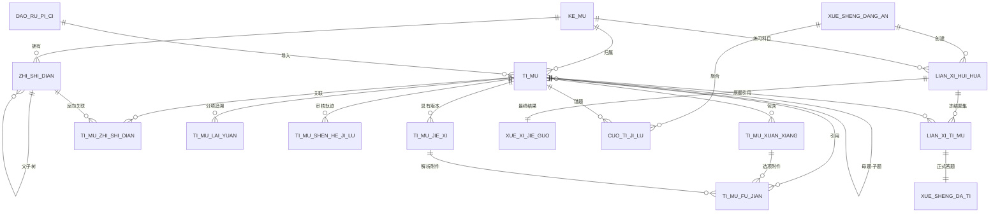

# 题库核心数据库模型 V1

更新时间：2026-08-04  
设计基线：V3.0  
数据库：MySQL 8.4 / `rike_tiku`  
状态：V1–V7，学生练习闭环当前分支实现、尚未合并

## 1. 设计边界

V1–V6覆盖题库、账号和教学组织；V7新增学生练习会话、冻结题目、正式答题事实、最终结果和错题聚合。没有 AI、Redis、MinIO、WebSocket、教师任务或主观题评分表。

用户给出的允许清单实际包含10张业务表，本版名称全部保持不变。除此之外，Flyway会自动创建系统表`flyway_schema_history`，它不是业务表。

## 2. ER关系



关系要点：

- `ke_mu`到`zhi_shi_dian`、`ti_mu`均为一对多。
- `zhi_shi_dian.fu_zhi_shi_dian_id`形成知识点树；`wan_zheng_lu_jing`保留Excel中的完整路径。
- `ti_mu`通过`fu_ti_mu_id`表达母题与拆分后的子题。结构异常母题可以保留为`SUBJECTIVE + TOPIC_LEARNING + 不自动判分`，但本轮没有把异常Q34写入MVP样本。
- `ti_mu_zhi_shi_dian`解决一道题对应多个知识点的问题。
- 选项、解析、附件、来源和审核记录均独立，避免把Excel“一行一题”直接固化成单表。
- `ti_mu_lai_yuan`按`QUESTION`、`ANSWER`、`STANDARD_ANALYSIS`分别保存，因此题干和答案解析可以来自不同文件。

## 3. 核心取舍

### 3.1 正确答案

`ti_mu.zheng_que_da_an`使用MySQL `JSON`，但不是EAV。它是按题型定义的受控文档：

```json
{"schemaVersion":1,"type":"SINGLE_CHOICE","optionLabels":["A"]}
```

```json
{"schemaVersion":1,"type":"MULTIPLE_CHOICE","optionLabels":["A","D"]}
```

未来填空多空可扩展为：

```json
{
  "schemaVersion": 1,
  "type": "FILL_BLANK",
  "blanks": [
    {"index": 1, "acceptedAnswers": ["R₁", "R1"], "caseSensitive": false},
    {"index": 2, "acceptedAnswers": ["电荷量"], "caseSensitive": false}
  ]
}
```

单选和多选的判分以`optionLabels`集合为准；`ti_mu_xuan_xiang.shi_fou_zheng_que`是便于查询和展示的冗余校验值，导入服务以后需要校验两者一致。填空答案按空位保存可接受答案，不需要新增EAV表。主观题保存`SUBJECTIVE`答案元数据，固定为`TOPIC_LEARNING`且不能自动判分。

### 3.2 难度

使用`TINYINT`：1=`easy`、2=`medium`、3=`hard`。数字适合范围筛选和排序，也忠实于当前三级数据；没有把三级数据伪造为五级。`nan_du_shuo_ming`保留离线整理阶段的难度说明。

### 3.3 附件位置

附件只保存相对路径和SHA-256，不保存BLOB。正文继续保留`〔图片对象 I126〕`或`〔公式对象 F107〕`标记；附件表同时保存：

- `dui_xiang_biao_shi`：`I126`、`F107`；
- `pai_xu`：同一正文中的出现顺序；
- `zheng_wen_zi_fu_wei_zhi`：标记在正文中的1基字符位置；
- `guan_lian_wei_zhi`：`QUESTION`、`OPTION`、`STANDARD_ANALYSIS`、`ANSWER`。

因此既能按顺序渲染，也能把附件准确替换回正文位置。

### 3.4 状态与版权

- 三道真实样本的题目、标准解析均为`PENDING`，没有任何`PUBLISHED`记录。
- 本地文件没有足够的授权证明，样本来源暂记为`COPYRIGHT_UNKNOWN`，获取时间未知时保持`NULL`。
- 每题写入一条`SUBMITTED: DRAFT -> PENDING`审核轨迹，人工审核人暂为空；用户表建立后再为`shen_he_ren_id`补外键。

## 4. 字段字典

### 4.1 `ke_mu`

| 字段 | 类型 | 约束/取值 | 说明 |
|---|---|---|---|
| `id` | BIGINT | PK, AUTO_INCREMENT | 科目ID |
| `ke_mu_dai_ma` | VARCHAR(32) | UNIQUE | `PHYSICS/CHEMISTRY/BIOLOGY` |
| `ke_mu_ming_cheng` | VARCHAR(32) | UNIQUE | 物理、化学、生物 |
| `pai_xu` | INT | 默认0 | 显示顺序 |
| `zhuang_tai` | VARCHAR(16) | `ACTIVE/DISABLED` | 科目状态 |
| `chuang_jian_shi_jian` | DATETIME(3) | 自动写入 | 创建时间 |
| `geng_xin_shi_jian` | DATETIME(3) | 自动更新 | 更新时间 |
| `yi_shan_chu` | TINYINT | 0/1 | 软删除标记 |

### 4.2 `zhi_shi_dian`

| 字段 | 类型 | 约束/取值 | 说明 |
|---|---|---|---|
| `id` | BIGINT | PK | 知识点ID |
| `ke_mu_id` | BIGINT | FK `ke_mu.id` | 所属科目 |
| `fu_zhi_shi_dian_id` | BIGINT | 可空，自关联FK | 父知识点 |
| `zhi_shi_dian_ming_cheng` | VARCHAR(128) | 非空 | 当前节点名称 |
| `wan_zheng_lu_jing` | VARCHAR(500) | 科目内唯一 | 完整知识点路径 |
| `ceng_ji` | SMALLINT | >=1 | 树层级 |
| `pai_xu` | INT | 默认0 | 同级顺序 |
| `zhuang_tai` | VARCHAR(16) | `ACTIVE/DISABLED` | 状态 |
| `chuang_jian_shi_jian` | DATETIME(3) | 自动写入 | 创建时间 |
| `geng_xin_shi_jian` | DATETIME(3) | 自动更新 | 更新时间 |
| `yi_shan_chu` | TINYINT | 0/1 | 软删除 |

### 4.3 `dao_ru_pi_ci`

| 字段 | 类型 | 约束/取值 | 说明 |
|---|---|---|---|
| `id` | BIGINT | PK | 批次ID |
| `pi_ci_bian_hao` | VARCHAR(64) | UNIQUE | 可读业务编号 |
| `dao_ru_lei_xing` | VARCHAR(32) | 默认`QUESTION` | 导入对象类型 |
| `yuan_shi_wen_jian_ming` | VARCHAR(255) | 非空 | 原文件名 |
| `yuan_shi_wen_jian_lu_jing` | VARCHAR(1000) | 可空 | 仓库或存储相对路径 |
| `wen_jian_ha_xi` | CHAR(64) | 可空 | 文件SHA-256 |
| `zong_ji_lu_shu` | INT | >=0 | 本批总记录数 |
| `cheng_gong_shu` | INT | >=0 | 成功数 |
| `shi_bai_shu` | INT | >=0 | 失败数 |
| `zhuang_tai` | VARCHAR(16) | `UPLOADED/VALIDATED/IMPORTED/FAILED` | 批次状态 |
| `bei_zhu` | VARCHAR(1000) | 可空 | 说明 |
| `chuang_jian_shi_jian` | DATETIME(3) | 自动写入 | 创建时间 |
| `geng_xin_shi_jian` | DATETIME(3) | 自动更新 | 更新时间 |

### 4.4 `ti_mu`

| 字段 | 类型 | 约束/取值 | 说明 |
|---|---|---|---|
| `id` | BIGINT | PK | 题目ID |
| `ke_mu_id` | BIGINT | FK | 科目 |
| `fu_ti_mu_id` | BIGINT | 可空，自关联FK | 母题 |
| `dao_ru_pi_ci_id` | BIGINT | 可空，FK | 导入批次 |
| `ti_mu_lei_xing` | VARCHAR(32) | `SINGLE_CHOICE/MULTIPLE_CHOICE/FILL_BLANK/SUBJECTIVE` | 题型 |
| `shi_yong_mo_shi` | VARCHAR(32) | `ONLINE_PRACTICE/TOPIC_LEARNING` | 使用模式 |
| `ti_gan` | LONGTEXT | 非空 | 题干及对象标记 |
| `zheng_que_da_an` | JSON | JSON对象 | 受控答案文档 |
| `nan_du` | TINYINT | 1/2/3 | easy/medium/hard |
| `nan_du_shuo_ming` | VARCHAR(500) | 可空 | 难度理由 |
| `shi_fou_ke_zi_dong_pan_fen` | TINYINT | 0/1 | 是否允许自动判分 |
| `zhuang_tai` | VARCHAR(16) | `DRAFT/PENDING/PUBLISHED/DISABLED` | 题目状态 |
| `nei_rong_ha_xi` | CHAR(64) | 科目内唯一 | 规范化内容SHA-256 |
| `chuang_jian_shi_jian` | DATETIME(3) | 自动写入 | 创建时间 |
| `geng_xin_shi_jian` | DATETIME(3) | 自动更新 | 更新时间 |
| `yi_shan_chu` | TINYINT | 0/1 | 软删除 |

### 4.5 `ti_mu_xuan_xiang`

| 字段 | 类型 | 约束/取值 | 说明 |
|---|---|---|---|
| `id` | BIGINT | PK | 选项ID |
| `ti_mu_id` | BIGINT | FK | 所属题目 |
| `xuan_xiang_biao_shi` | VARCHAR(16) | 题目内唯一 | A、B、C、D及未来更多标识 |
| `xuan_xiang_nei_rong` | LONGTEXT | 非空 | 选项正文 |
| `shi_fou_zheng_que` | TINYINT | 0/1 | 正确选项冗余标记 |
| `pai_xu` | INT | >=1 | 显示顺序 |
| `chuang_jian_shi_jian` | DATETIME(3) | 自动写入 | 创建时间 |
| `geng_xin_shi_jian` | DATETIME(3) | 自动更新 | 更新时间 |
| `yi_shan_chu` | TINYINT | 0/1 | 软删除 |

### 4.6 `ti_mu_jie_xi`

| 字段 | 类型 | 约束/取值 | 说明 |
|---|---|---|---|
| `id` | BIGINT | PK | 解析ID |
| `ti_mu_id` | BIGINT | FK | 所属题目 |
| `jie_xi_lei_xing` | VARCHAR(16) | `STANDARD/TEACHER/AI` | 解析来源类型 |
| `jie_xi_nei_rong` | LONGTEXT | 非空 | 解析正文及对象标记 |
| `ban_ben_hao` | INT | >=1 | 同类型版本号 |
| `zhuang_tai` | VARCHAR(16) | 题目状态同域 | 解析审核/启停状态 |
| `chuang_jian_shi_jian` | DATETIME(3) | 自动写入 | 创建时间 |
| `geng_xin_shi_jian` | DATETIME(3) | 自动更新 | 更新时间 |
| `yi_shan_chu` | TINYINT | 0/1 | 软删除 |

### 4.7 `ti_mu_zhi_shi_dian`

| 字段 | 类型 | 约束/取值 | 说明 |
|---|---|---|---|
| `id` | BIGINT | PK | 关系ID |
| `ti_mu_id` | BIGINT | FK | 题目 |
| `zhi_shi_dian_id` | BIGINT | FK | 知识点 |
| `shi_fou_zhu_yao` | TINYINT | 0/1 | 是否主知识点 |
| `pai_xu` | INT | >=1 | 多知识点顺序 |
| `chuang_jian_shi_jian` | DATETIME(3) | 自动写入 | 创建时间 |
| `geng_xin_shi_jian` | DATETIME(3) | 自动更新 | 更新时间 |
| `yi_shan_chu` | TINYINT | 0/1 | 软删除 |

### 4.8 `ti_mu_fu_jian`

| 字段 | 类型 | 约束/取值 | 说明 |
|---|---|---|---|
| `id` | BIGINT | PK | 附件ID |
| `ti_mu_id` | BIGINT | FK | 所属题目 |
| `ti_mu_xuan_xiang_id` | BIGINT | 可空，FK | `OPTION`附件对应选项 |
| `ti_mu_jie_xi_id` | BIGINT | 可空，FK | `STANDARD_ANALYSIS`附件对应解析 |
| `guan_lian_wei_zhi` | VARCHAR(32) | `QUESTION/OPTION/STANDARD_ANALYSIS/ANSWER` | 正文区域 |
| `fu_jian_lei_xing` | VARCHAR(16) | `IMAGE/FORMULA/OTHER` | 附件类型 |
| `yuan_shi_wen_jian_ming` | VARCHAR(255) | 非空 | 原文件名 |
| `xiang_dui_lu_jing` | VARCHAR(1000) | 非空 | 相对路径，不存BLOB |
| `nei_rong_ha_xi` | CHAR(64) | 非空 | 附件SHA-256 |
| `dui_xiang_biao_shi` | VARCHAR(64) | 可空 | `I126/F107`等 |
| `zheng_wen_zi_fu_wei_zhi` | INT | 可空 | 1基字符位置 |
| `yuan_shi_ye_ma` | VARCHAR(32) | 可空 | 原文页码 |
| `fu_jian_shuo_ming` | VARCHAR(1000) | 可空 | 对象说明和复核提示 |
| `pai_xu` | INT | >=1 | 正文内顺序 |
| `zhuang_tai` | VARCHAR(16) | `ACTIVE/DISABLED/MISSING` | 文件状态 |
| `chuang_jian_shi_jian` | DATETIME(3) | 自动写入 | 创建时间 |
| `geng_xin_shi_jian` | DATETIME(3) | 自动更新 | 更新时间 |
| `yi_shan_chu` | TINYINT | 0/1 | 软删除 |

### 4.9 `ti_mu_lai_yuan`

| 字段 | 类型 | 约束/取值 | 说明 |
|---|---|---|---|
| `id` | BIGINT | PK | 来源ID |
| `ti_mu_id` | BIGINT | FK | 题目 |
| `nei_rong_lei_xing` | VARCHAR(32) | `QUESTION/ANSWER/STANDARD_ANALYSIS` | 被追溯的内容 |
| `lai_yuan_lei_xing` | VARCHAR(32) | `REAL_EXAM/AI_GENERATED/TEACHER_CREATED` | 来源类型 |
| `lai_yuan_ming_cheng` | VARCHAR(500) | 非空 | 来源名称 |
| `lai_yuan_di_zhi` | VARCHAR(1000) | 可空 | URL或相对文件路径 |
| `nian_fen` | SMALLINT | 可空 | 年份 |
| `di_qu` | VARCHAR(100) | 可空 | 地区 |
| `shi_juan_ming_cheng` | VARCHAR(500) | 可空 | 试卷名 |
| `ti_hao` | VARCHAR(64) | 可空 | 原题号，不强制数字 |
| `quan_li_zhuang_tai` | VARCHAR(32) | V3.0版权枚举 | 权利状态 |
| `quan_li_yi_ju` | VARCHAR(1000) | 可空 | 授权/判断依据 |
| `huo_qu_shi_jian` | DATETIME(3) | 可空 | 未知不猜测 |
| `chuang_jian_shi_jian` | DATETIME(3) | 自动写入 | 创建时间 |
| `geng_xin_shi_jian` | DATETIME(3) | 自动更新 | 更新时间 |
| `yi_shan_chu` | TINYINT | 0/1 | 软删除 |

### 4.10 `ti_mu_shen_he_ji_lu`

| 字段 | 类型 | 约束/取值 | 说明 |
|---|---|---|---|
| `id` | BIGINT | PK | 审核记录ID |
| `ti_mu_id` | BIGINT | FK | 题目 |
| `shen_he_dong_zuo` | VARCHAR(32) | `SUBMITTED/APPROVED/REJECTED/DISABLED` | 动作 |
| `yuan_zhuang_tai` | VARCHAR(16) | 可空 | 动作前状态 |
| `mu_biao_zhuang_tai` | VARCHAR(16) | 非空 | 动作后状态 |
| `shen_he_ren_id` | BIGINT | 可空，暂不设FK | 未来审核用户ID |
| `shen_he_yi_jian` | VARCHAR(2000) | 可空 | 审核说明 |
| `chuang_jian_shi_jian` | DATETIME(3) | 自动写入 | 动作时间 |

## 5. Excel/JSON到数据库映射

三科`待审核_清洗版.xlsx`的`题目检查`表均为A:S共19列；结构化附件、选项和来源以同目录JSON为准。最终样本值又与`MVP30入库候选_最终版.json`交叉核对。

| Excel列 / JSON字段 | 数据库目标 | 转换规则 |
|---|---|---|
| 学科 / `subject` | `ke_mu`、`ti_mu.ke_mu_id` | 物理/化学/生物映射到固定科目ID |
| 年份 / `year` | `ti_mu_lai_yuan.nian_fen` | 保持整数 |
| 区域 / `region` | `ti_mu_lai_yuan.di_qu` | 原值保留 |
| 试卷来源 / `paperName` | `shi_juan_ming_cheng` | 原值保留 |
| 题号 / `questionNumber` | `ti_mu_lai_yuan.ti_hao` | 使用字符串，兼容子题号 |
| 题型 / `questionType` | `ti_mu.ti_mu_lei_xing`、`shi_yong_mo_shi` | 单选→`SINGLE_CHOICE`；多选→`MULTIPLE_CHOICE`；实验填空→`FILL_BLANK`；结构异常主观母题未来→`SUBJECTIVE/TOPIC_LEARNING` |
| 题干 / `content` | `ti_mu.ti_gan` | 保留对象标记 |
| 选项 / `options[]` | `ti_mu_xuan_xiang` | JSON的label/content逐项拆行；Excel换行文本只作人工查看 |
| 答案 / `correctAnswer` | `ti_mu.zheng_que_da_an`、选项正确标记 | 单选生成1个label，多选拆为label数组，填空按空位构造 |
| 标准解析 / `standardAnalysis` | `ti_mu_jie_xi` | `jie_xi_lei_xing=STANDARD`，版本1，当前`PENDING` |
| 题干图片数 | 不直接落库 | 由`ti_mu_fu_jian`中`QUESTION/OPTION`记录统计 |
| 解析图片数 | 不直接落库 | 由`STANDARD_ANALYSIS`附件统计 |
| 一级知识点 | `zhi_shi_dian`一级节点 | 从完整路径首段生成，可校验Excel展示列 |
| 知识点 / `knowledgePoints[]` | `zhi_shi_dian.wan_zheng_lu_jing`和关联表 | 逐段建树，题目关联叶子节点；支持未来多知识点 |
| 难度 / `difficultyLevel` | `ti_mu.nan_du` | easy→1，medium→2，hard→3 |
| 难度说明 / `difficultyReason` | `ti_mu.nan_du_shuo_ming` | 原值保留 |
| 答案解析审核状态 / `analysisReviewStatus` | `ti_mu_jie_xi.zhuang_tai` | 待审核→`PENDING` |
| 审核状态 / `reviewStatus` | `ti_mu.zhuang_tai`和审核记录 | 待审核→`PENDING`，并写`SUBMITTED`轨迹 |
| 来源文件 / `sourceFile.paper` | `ti_mu_lai_yuan`的`QUESTION` | 独立来源行 |
| `sourceFile.answerAnalysis` | `ANSWER`和`STANDARD_ANALYSIS`来源行 | 即使同文件也分两行，未来可以分别替换 |
| `questionImages[]` | `ti_mu_fu_jian` | 根据标记所在题干或选项写`QUESTION/OPTION`，解析对象标识、顺序和字符位置 |
| `analysisImages[]` | `ti_mu_fu_jian` | 写`STANDARD_ANALYSIS`并关联标准解析版本 |
| `imagePath/sourcePage/description` | 附件路径、页码、说明 | 绝对路径转仓库相对路径，文件计算SHA-256 |

`nei_rong_ha_xi`计算口径为：`subject + questionType + content + 按顺序的label=content`，统一换行为LF、整体trim后做UTF-8 SHA-256。它用于候选去重，不替代来源追溯。

## 6. 三道最小真实样本

| 科目 | 年份/试卷/题号 | 题型 | 答案 | 难度 | 状态 | 附件 |
|---|---|---|---|---|---|---|
| 物理 | 2023新课标卷 Q14 | 单选 | A | 1 | PENDING | 标准解析公式`F107`，路径和SHA-256已验证 |
| 化学 | 2023新课标卷 Q7 | 单选 | C | 1 | PENDING | 无附件 |
| 生物 | 2023新课标卷 Q1 | 单选 | B | 1 | PENDING | 无附件 |

只写入3题、12个选项、3条标准解析、3条知识点关联、1条真实附件引用、9条分项来源和3条审核记录。完整30题没有导入。

## 7. 学生练习 V7

`V7__create_student_practice_and_wrong_question_tables.sql`创建五张表：

- `lian_xi_hui_hua`：学生、科目、`CREATED/SUBMITTED` 状态和题量；
- `lian_xi_ti_mu`：题目顺序、分值、题干/选项/答案/解析/知识点冻结快照；
- `xue_sheng_da_ti`：同一会话题目唯一的一条正式原始答题事实、正误、得分和用时；
- `xue_xi_jie_guo`：会话唯一最终结果；
- `cuo_ti_ji_lu`：学生—题目唯一聚合，保留错误次数、连续正确次数、状态和最近答题。

全部外键使用 `ON DELETE RESTRICT`，学习事实不物理删除。提交服务在同一事务中锁定会话、写答题事实、更新错题、写最终结果并切换会话状态；任一失败整体回滚。

## 8. Flyway版本

| 版本 | 作用 |
|---|---|
| `V1__create_subject_and_knowledge_tables.sql` | 创建科目和知识点树 |
| `V2__create_question_core_tables.sql` | 创建题库核心8张表和约束、索引 |
| `V3__insert_three_subject_question_samples.sql` | 写入三科各1道真实待审核样本 |
| `V4__allow_subjective_topic_learning.sql` | 与V3.0对齐：允许主观母题，但强制专题学习且禁止自动判分 |
| `V5__create_user_role_and_profile_tables.sql` | 用户、角色、学生/教师档案 |
| `V6__create_class_and_teaching_relationship_tables.sql` | 班级、班级学生历史和三元任课关系 |
| `V7__create_student_practice_and_wrong_question_tables.sql` | 学生练习、答题事实、结果与错题聚合 |

所有建表和结构变更均由Flyway执行，没有手工创建业务表。
